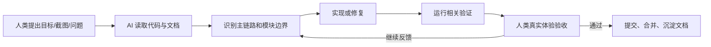

# AgentHub 多智能体协作平台：AI 协作开发记录与工程产物说明

## 1. 项目背景

AgentHub 是一个以 IM 工作台为核心的多智能体协作平台。用户可以通过单聊、群聊、工作流画布、Tool / Skill / MCP、文件系统、沙箱和部署预览完成从需求提出到产物交付的闭环。

本项目开发过程采用“人类负责人 + AI Coding Agent”的协作模式。人类负责人负责产品目标、体验验收、优先级判断和最终合并；AI Coding Agent 负责阅读需求、实现功能、重构模块、定位问题、补充文档和整理协作资产。

## 2. 为什么这是 AI 协作开发

本项目不是一次性提示词生成代码，而是持续迭代式协作：

1. 人类负责人持续提出需求和真实体验问题。
2. AI 读取代码、文档、截图、日志和 Git 状态。
3. AI 按架构边界实现或修复。
4. 人类负责人通过本地运行结果验收。
5. AI 将稳定经验沉淀为 Spec、Rules、Skills、Prompt 和文档。

## 3. Git 历史证据链

近期 Git 历史体现了 AI 协作演进：

| 方向 | 代表提交 | 说明 |
| --- | --- | --- |
| 多端与发布包装 | `feat(agenthub): add desktop mobile clients and platform demo`、`feat(agenthub): complete desktop and mobile clients` | Web 主力端之外补充桌面端、移动端和平台演示 |
| 项目交付真实化 | `fix(agenthub): require real project delivery outputs`、`fix(agenthub): stop templated html fallback` | 从“模板式假产物”修到“真实项目文件和真实预览” |
| 多 Agent 调度 | `fix(agenthub): sequence fullstack multi-agent delivery`、`fix(agenthub): make tech lead scheduling dependency-aware` | 让 Team Leader 按依赖链组织 Backend / Frontend / Deploy |
| 部署预览 | `fix(agenthub): expose deployed artifact URLs`、`fix(agenthub): stabilize fullstack deployment previews` | 让部署链接可真实访问，并支持后端代理 |
| 运行时稳定 | `fix: stabilize streaming runtime message order`、`fix: stabilize artifact preview message ordering` | 修复流式消息、产物卡片和状态顺序问题 |
| 外部 Coding Agent | `feat: unify external agent invocation`、`fix(external-agents): auto approve cli permissions` | 接入 Codex / Claude Code 作为外部长任务能力 |

## 4. 协作角色与分工

| 角色 | 职责 |
| --- | --- |
| 人类负责人 | 定义目标、补充需求、体验验收、架构取舍、合并判断 |
| Codex / Claude Code | 代码实现、跨模块排查、重构、轻量验证、文档整理 |
| AgentHub Team Leader | 在产品内部调度 Agent，负责计划、依赖判断和结果汇总 |
| Backend / Frontend / Reviewer / Deploy Agent | 分别负责服务、页面、审查、部署等专项能力 |

## 5. AI 协作流程

## 6. 规范沉淀

仓库中已沉淀以下 AI 协作资产：

- 协作过程：[01-collaboration-log.md](./01-collaboration-log.md)
- 协作 Spec：[02-ai-collaboration-spec.md](./02-ai-collaboration-spec.md)
- 协作 Rules：[03-agent-rules.md](./03-agent-rules.md)
- Skills / Prompts：[04-skills-and-prompts.md](./04-skills-and-prompts.md)
- 产物索引：[05-artifact-index.md](./05-artifact-index.md)

## 7. 典型案例

### 案例 A：部署链接空白

- 现象：部署 URL 返回 200，但页面空白。
- AI 排查：用 Playwright 捕获浏览器错误，定位到 Ant Design UMD 缺少 `dayjs`，导致页面没有挂载。
- 修复：部署发布阶段自动补齐依赖、Babel 支持、后端代理注入和兜底加载提示。
- 结果：部署 URL 可直接打开页面，并能通过代理访问后端 API。

### 案例 B：前后端项目协作顺序

- 现象：多 Agent 同时开始，前端没有基于后端接口契约实现。
- 修复：Team Leader 先指派 Backend Worker 产出 API 契约，再指派 Frontend Worker 对接，最后 Deploy Agent 部署。
- 价值：从“多人同时答题”升级为“按依赖链协作交付”。

### 案例 C：产物假成功

- 现象：Agent 口头说已生成 PDF/HTML，但没有真实文件或 preview_card。
- 修复：统一 Tool Result -> Artifact -> Preview Card -> Export URL 链路。
- 价值：AI 输出必须可追踪、可预览、可下载。

## 8. 核心产物地址

| 类型 | 地址/路径 | 说明 |
| --- | --- | --- |
| GitHub 仓库 | `https://github.com/jiajiajiaxr/bottled-water` | AgentHub 主仓库 |
| 后端源码 | `backend/src` | FastAPI、Agent Runtime、Tools、Artifacts、Deployments |
| 前端源码 | `frontend/src` | IM 工作台、工作流画布、文件系统、预览面板 |
| 架构文档 | `docs/backend-architecture.md` | 后端服务边界 |
| 运行时文档 | `docs/agent-workflow-runtime.md` | 单聊、群聊、工作流运行语义 |
| AI 协作资产 | `docs/ai-collaboration-record/` | 本材料包 |

## 9. 后续复用方式

1. 新任务先套用 `02-ai-collaboration-spec.md` 定义目标和验收。
2. 编码时遵守 `03-agent-rules.md` 控制边界。
3. 多 Agent 项目使用 `04-skills-and-prompts.md` 中的调度协议。
4. 重要修复继续追加到 `01-collaboration-log.md`，形成长期协作知识库。

