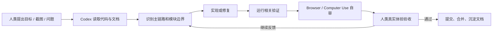

# AgentHub 多智能体协作平台：AI 编程协作记录与工程产物说明

## 1. 项目背景

AgentHub 是一个以 IM 工作台为核心的多智能体协作平台。用户可以通过单聊、群聊、工作流画布、Tool / Skill / MCP、文件系统、沙箱和部署预览完成从需求提出到产物交付的闭环。

本项目开发过程采用“人类负责人 + Codex 工程 Agent + Browser / Computer Use 自审 + Git 证据链”的协作模式。人类负责人负责产品目标、体验验收、优先级判断和最终合并；Codex 负责阅读需求、实现功能、重构模块、定位问题、补充文档和整理协作资产；Browser / Computer Use 用于像真实用户一样进行页面操作、自我审查和问题复现。

## 2. 为什么这是 AI 协作开发

本项目不是一次性提示词生成代码，而是持续迭代式协作：

1. 人类负责人持续提出需求、截图、反例和真实体验问题。
2. Codex 读取代码、文档、日志、Git 状态和本地运行环境。
3. Codex 按架构边界实现、修复、重构和补充文档。
4. 人类负责人通过本地页面体验验收，必要时让 Codex 使用 Browser / Computer Use 自审。
5. 稳定经验被沉淀为 Spec、Rules、AI 编程 Skills、Prompt 模板和协作记录。

其中，Skills / Prompts 指的是“如何使用 Codex 和配套工具完成高质量 AI 编程协作”的方法资产，而不是 AgentHub 产品内部的业务 Skill 配置。

## 3. Git 历史证据链

近期 Git 历史体现了 AI 协作演进：

| 方向 | 代表提交 | 说明 |
| --- | --- | --- |
| 多端与发布包装 | `feat(agenthub): add desktop mobile clients and platform demo`、`feat(agenthub): complete desktop and mobile clients` | Web 主力端之外补充桌面端、移动端和平台演示 |
| 项目交付真实化 | `fix(agenthub): require real project delivery outputs`、`fix(agenthub): stop templated html fallback` | 从“模板式假产物”修到“真实项目文件和真实预览” |
| 多 Agent 调度 | `fix(agenthub): sequence fullstack multi-agent delivery`、`fix(agenthub): make tech lead scheduling dependency-aware` | 让 Team Leader 按依赖链组织 Backend / Frontend / Deploy |
| 部署预览 | `fix(agenthub): expose deployed artifact URLs`、`fix(agenthub): stabilize fullstack deployment previews` | 让部署链接可真实访问，并支持后端代理 |
| 运行时稳定 | `fix: stabilize streaming runtime message order`、`fix: stabilize artifact preview message ordering` | 修复流式消息、产物卡片和状态顺序问题 |
| 外部 Coding Agent | `feat: unify external agent invocation`、`fix(external-agents): auto approve cli permissions` | 接入 Codex / Claude Code 作为外部长任务能力 |
| AI 协作文档 | `docs(agenthub): add ai collaboration record package` | 将协作流程、规范、技能和产物索引沉淀为文档包 |

## 4. 协作角色与分工

| 角色 | 职责 |
| --- | --- |
| 人类负责人 | 定义目标、补充需求、体验验收、架构取舍、合并判断 |
| Codex | 代码实现、跨模块排查、重构、轻量验证、文档整理、Git 操作 |
| Browser / Computer Use | 页面操作、视觉检查、点击验证、截图复盘、前端问题自审 |
| Git | 记录阶段性成果，形成可追溯证据链 |
| AgentHub Team Leader | 在产品内部调度 Agent，负责计划、依赖判断和结果汇总 |
| Backend / Frontend / Reviewer / Deploy Agent | 在产品内部承担服务、页面、审查、部署等专项能力 |

## 5. AI 协作流程

## 6. 规范沉淀

仓库中已沉淀以下 AI 协作资产：

- 协作过程：[01-collaboration-log.md](./01-collaboration-log.md)
- 协作 Spec：[02-ai-collaboration-spec.md](./02-ai-collaboration-spec.md)
- 协作 Rules：[03-agent-rules.md](./03-agent-rules.md)
- AI 编程 Skills / Prompts：[04-skills-and-prompts.md](./04-skills-and-prompts.md)
- 产物索引：[05-artifact-index.md](./05-artifact-index.md)

## 7. 典型案例

### 案例 A：部署链接空白

- 现象：部署 URL 返回 200，但页面空白。
- AI 排查：通过浏览器自审定位到前端资源和依赖加载问题。
- 修复：部署发布阶段补齐依赖、代理注入和兜底加载提示。
- 结果：部署 URL 可直接打开页面，并能通过代理访问后端 API。

### 案例 B：前后端项目协作顺序

- 现象：多 Agent 同时开始，前端没有基于后端接口契约实现。
- 修复：Team Leader 先指派 Backend Worker 产出 API 契约，再指派 Frontend Worker 对接，最后 Deploy Agent 部署。
- 价值：从“多人同时答题”升级为“按依赖链协作交付”。

### 案例 C：产物假成功

- 现象：Agent 口头说已生成 PDF/HTML，但没有真实文件或 preview_card。
- 修复：统一 Tool Result -> Artifact -> Preview Card -> Export URL 链路。
- 价值：AI 输出必须可追踪、可预览、可下载。

### 案例 D：Computer Use 自审发现体验问题

- 现象：代码层面接口返回正常，但页面点击无反应、输入框回弹、预览空白。
- 修复：通过真实页面操作复现，从前端状态、API 返回、数据库记录逐层定位。
- 价值：把“代码看起来正确”升级为“用户真实可用”。

## 8. 核心产物地址

| 类型 | 地址/路径 | 说明 |
| --- | --- | --- |
| GitHub 仓库 | `https://github.com/jiajiajiaxr/bottled-water` | AgentHub 主仓库 |
| 后端源码 | `backend/src` | FastAPI、Agent Runtime、Tools、Artifacts、Deployments |
| 前端源码 | `frontend/src` | IM 工作台、工作流画布、文件系统、预览面板 |
| 架构文档 | `docs/backend-architecture.md` | 后端服务边界 |
| 运行时文档 | `docs/agent-workflow-runtime.md` | 单聊、群聊、工作流运行语义 |
| AI 协作资产 | `docs/ai-collaboration-record/` | 本材料包 |

## 9. 后续复用方式

1. 新任务先套用 `02-ai-collaboration-spec.md` 定义目标和验收。
2. 编码时遵守 `03-agent-rules.md` 控制边界。
3. 复杂工程任务使用 `04-skills-and-prompts.md` 中的 Codex / Browser / Computer Use 协作协议。
4. 重要修复继续追加到 `01-collaboration-log.md`，形成长期协作知识库。
