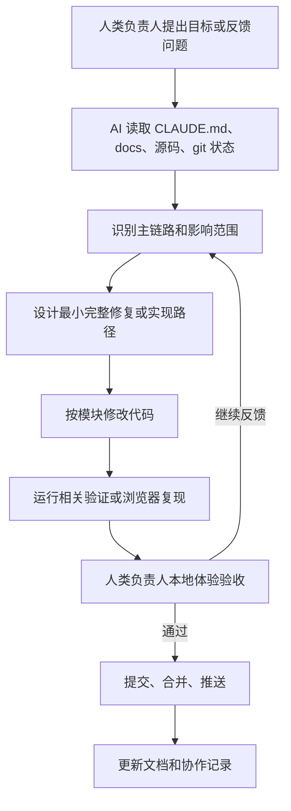

# AI 协作开发过程记录


## 1. 协作定位

AgentHub 本身是一个多智能体协作平台，而它的开发过程也采用了类似的协作模式：

- **人类负责人**：负责提出产品目标、定义验收口径、判断优先级、发现真实体验问题、决定是否合并。
- **AI Coding Agent**：负责阅读文档和代码、拆解任务、实现功能、定位 bug、重构模块、补充文档、整理协作资产。
- **Git 历史与文档**：负责沉淀过程证据，形成可追溯的工程交付链。

协作的核心不是“让 AI 替代开发者”，而是让 AI 成为工程负责人身边的高强度执行伙伴：它可以快速读代码、写代码、跑验证、总结上下文，但最终方向、质量标准和产品判断仍由人类负责人控制。

## 2. 协作原则

本项目在协作过程中逐步形成了几条稳定原则。

### 2.1 真实闭环优先

AgentHub 很多功能都容易做成“看起来有”的 Demo，例如：

- Agent 说“已生成 PDF”，但没有真实文件。
- 页面显示“deployed”，但没有可访问 URL。
- 工具调用显示成功，但没有 ToolInvocation 记录。
- 工作流显示运行，但节点没有真实输出。

因此协作中反复强调：

```text
不能假装成功。
工具必须真实执行。
产物必须真实落库。
部署必须真实可访问。
失败必须明确告诉用户原因。
```

### 2.2 人类体验反馈驱动修复

大量关键问题不是靠单元测试发现的，而是人类负责人通过真实使用发现的：

- 点击预览没有反应。
- 部署链接打开空白。
- 群聊第二轮不回复。
- 思考块和回复内容拆成两条消息。
- 多 Agent 项目中前端没有等后端契约。
- HTML 产物只显示源码，不能看到运行效果。

这些反馈让 AI 的工作从“功能已实现”推进到“体验可演示”。

### 2.3 架构边界优先

随着功能复杂度提升，用户明确要求不能继续堆代码。于是 AI 逐步将功能拆分到清晰模块：

- `agent_runtime`：会话运行时、Actor、Scheduler、Blackboard。
- `services/tools`：工具目录、权限、schema 校验、执行分发。
- `services/artifacts`：产物生成、预览、导出、版本。
- `services/files`：工作区文件、上传、预览、下载。
- `services/deployments`：部署预览、站点发布、后端代理。
- `services/workflow`：画布定义、运行态、节点执行。

这使项目从“能跑”逐步转向“能维护、能扩展”。

### 2.4 Git 历史作为协作证据

每轮关键修复都通过 Git 提交沉淀。Git 历史不只是版本管理，也成为 AI 协作过程的证据链：

- 什么时候补齐了多端能力。
- 什么时候修复了模板假产物。
- 什么时候引入了依赖感知调度。
- 什么时候稳定了部署预览。
- 什么时候修复了流式消息顺序。

这些记录可以支撑答辩中“AI 协作能力”的说明。

## 3. 总体协作流程



这个流程在项目中重复执行了很多轮。每一轮的重点不是“生成很多代码”，而是把一个具体链路修到可以被真实使用。

## 4. Git 历史反映的阶段演进

以下阶段来自近期 Git 历史与实际协作任务的归纳。

| 阶段 | 代表提交 | 协作重点 | 结果 |
| --- | --- | --- | --- |
| 产品展示与多端扩展 | `feat(agenthub): add desktop mobile clients and platform demo`、`feat(agenthub): complete desktop and mobile clients` | 补充桌面端、移动端和平台演示材料 | AgentHub 不只停留在 Web 工作台，也具备三端展示基础 |
| 项目交付真实化 | `fix(agenthub): require real project delivery outputs`、`fix(agenthub): stop templated html fallback` | 禁止死模板、要求真实文件和真实预览 | 生成项目时不再只返回空壳 HTML |
| 多 Agent 调度优化 | `fix(agenthub): sequence fullstack multi-agent delivery`、`fix(agenthub): make tech lead scheduling dependency-aware`、`fix(agenthub): keep scheduler tasks requirement-specific` | 让 Team Leader 理解任务依赖，不盲目并行 | 后端先给接口契约，前端再对接，部署最后发布 |
| 部署链路增强 | `fix(agenthub): expose deployed artifact URLs`、`fix(agenthub): stabilize fullstack deployment previews` | 部署 URL、后端代理、HTML 空白修复 | 部署链接能真实打开，并可代理访问生成后端 |
| 运行时稳定 | `fix: stabilize streaming runtime message order`、`fix: stabilize artifact preview message ordering` | 流式消息、产物卡片、状态收敛 | 降低重复消息、顺序错乱、切换会话状态丢失等问题 |
| 外部 Coding Agent 接入 | `feat: unify external agent invocation`、`fix(external-agents): auto approve cli permissions` | Codex / Claude Code 作为外部长任务能力 | 外部 Coding Agent 被纳入工具和权限体系 |
| 文档与发布包装 | `Add AI product release page`、`docs: refresh current runtime documentation` | 产品发布页、架构文档、运行时说明 | 支撑 GitHub 发布、答辩和飞书展示 |

这些提交共同体现了一个演进路径：

```text
能跑的原型
  -> 功能闭环完整
  -> 架构边界清晰
  -> 体验问题可修复
  -> 产物与部署真实可用
  -> 协作过程可沉淀
```

### 4.1 关键历史提交细目

为了增强可核验性，下面列出一组可以直接在仓库中查询的关键提交。这些提交覆盖了“产品能力建设、运行时稳定、多 Agent 调度、真实产物、部署预览、外部 Agent、文档包装”等核心协作阶段。

| Commit | 提交信息 | 对应能力 | AI 协作意义 |
| --- | --- | --- | --- |
| `4a22321` | `fix(agenthub): stabilize fullstack deployment previews` | 全栈部署预览、后端代理、HTML 空白页修复 | 通过浏览器运行错误定位到部署页依赖缺失，补齐 dayjs/Babel/API 代理，使部署 URL 从“返回 200 但空白”变成可访问页面 |
| `22d69f4` | `feat(agenthub): complete desktop and mobile clients` | 桌面端、移动端、平台演示收口 | 将 Web 主力端之外的信息同步和轻指令入口包装为可展示的三端能力 |
| `9b8e567` | `feat(agenthub): add desktop mobile clients and platform demo` | 多端原型与平台演示 | 说明 AI 协作不只局限在 Web 页面，也能围绕产品展示补齐外层形态 |
| `0f48f3e` | `fix(agenthub): require real project delivery outputs` | 真实项目交付 | 针对“Agent 口头完成但没有真实文件”的问题，要求项目任务必须产生可追踪工作区输出 |
| `84217eb` | `fix(agenthub): stop templated html fallback` | 禁止死模板 HTML | 修复生成 Web 项目时反复出现固定模板的问题，让产物来自 Agent 实际生成内容 |
| `22b80d3` | `fix(agenthub): enforce project delivery previews` | 项目预览卡片 | 强化项目类任务的 preview_card 生成链路，避免只在回复里说“已完成” |
| `8e8ae3f` | `fix(agenthub): align project delivery with workspace code and preview cards` | 工作区文件与预览卡片对齐 | 将工作区代码、Artifact 和聊天卡片统一到同一条交付链 |
| `441defb` | `fix(agenthub): keep scheduler tasks requirement-specific` | 调度任务按需求定制 | 修复调度任务泛化、串题和固定模板化问题，让 Scheduler 更贴近用户当前需求 |
| `a48bc9e` | `fix(agenthub): make tech lead scheduling dependency-aware` | 依赖感知调度 | 让 Team Leader 理解“后端先产出契约、前端再对接、部署最后验证”的依赖关系 |
| `55fbb51` | `fix(agenthub): sequence fullstack multi-agent delivery` | 全栈任务分阶段执行 | 从多 Agent 并行抢答升级为按阶段推进的协作交付 |
| `6814e9f` | `fix(agenthub): expose deployed artifact URLs` | 部署地址暴露 | 让部署 Agent 输出真实可访问 URL，而不是只显示 deployed 状态 |
| `6e4b9ba` | `feat: add interactive terminal tools` | 交互式终端工具 | 扩展 Agent 可用工具边界，为运行项目、查看输出、调试服务提供能力 |
| `f81a076` | `fix: keep runtime workspaces outside backend source` | 运行工作区隔离 | 将运行时工作目录从后端源码中隔离出去，降低生成文件污染源码的风险 |
| `137c73a` | `feat: encrypt new sensitive data and files` | 敏感数据与文件加密 | 强化安全边界，避免模型配置、文件等敏感内容裸存 |
| `8e79d30` | `Add AI product release page` | 产品发布页 | 用更适合 GitHub 发布和答辩的方式包装 AgentHub 产品能力 |
| `dfce17a` | `fix(external-agents): auto approve cli permissions` | Codex / Claude Code 权限策略 | 将外部 Coding Agent 的权限处理纳入平台默认策略，减少外部 CLI 阻塞 |
| `e306e52` | `fix(context): restore Chinese memory prompts` | 中文上下文与记忆提示 | 修复中文提示乱码，保证 Agent 上下文说明可读 |
| `9833280` | `docs: refresh current runtime documentation` | 运行时文档 | 将实现后的运行时语义同步到文档，避免文档和代码脱节 |
| `5898418` | `fix: improve multi-agent runtime coordination` | 多 Agent 运行时协同 | 修复群聊调度、Agent 状态和运行时协调问题 |
| `07c6513` | `feat: unify external agent invocation` | 外部 Coding Agent 统一调用 | 将 Codex / Claude Code 等外部 Agent 接入统一执行入口，而不是散落在工具或沙箱里 |
| `cd26ac6` | `fix: bind workflow agent nodes and show node io` | 工作流 Agent 节点与输入输出 | 让工作流节点和 Agent 绑定更明确，节点输入输出可观察 |
| `d1e167a` | `fix: constrain mention scheduling to target agents` | `@Agent` 指定调度 | 修复用户点名某个 Agent 时其他 Agent 也参与的问题 |
| `f2b8b69` | `fix: stabilize artifact preview message ordering` | 产物卡片消息顺序 | 修复卡片先于自然语言、重复出现或顺序错乱的问题 |
| `3ecc465` | `fix: stabilize streaming runtime message order` | 流式消息顺序 | 修复流式消息合并、重复和切换会话后显示不一致的问题 |
| `92f6e77` | `Improve document generation quality` | 文档生成质量 | 强化 PDF/Word 生成的结构化内容和正式文档排版 |
| `c14e324` | `fix: support container deployment preview mode` | 容器部署预览 | 支持更接近真实发布形态的预览模式 |
| `38d556d` | `fix: stabilize chat streaming and send queue` | 聊天发送队列 | 修复异步聊天中连续发送、排队、流式状态不一致问题 |
| `1e3f333` | `fix: stabilize chat streaming pipeline` | 聊天流式主链路 | 针对“回复不显示/切换后才显示”等体验问题稳定前后端消息流 |
| `11449c9` | `feat: connect group runtime to context builder` | 群聊上下文 | 将群聊 Agent 视角接入统一 ContextBuilder，增强成员身份和历史可见性 |
| `be88d63` | `fix(chat): support OCR attachments and user avatars` | 附件与头像 | 补充图片/OCR 附件处理和用户头像展示 |
| `29118ae` | `fix(chat): isolate conversations and stabilize streaming` | 会话隔离与流式稳定 | 修复不同会话之间运行状态和流式消息互相污染的问题 |
| `6fb20e3` | `fix(chat): persist thinking and stabilize streaming replies` | 思考模式持久化 | 将思考模式绑定到消息级别，避免历史消息显示逻辑错乱 |
| `2f87f45` | `fix(chat): stabilize workflow editing and workspace file map` | 工作流编辑与文件地图 | 修复工作流输入框、文件地图和文件系统展示问题 |
| `499a88e` | `fix(workspace-files): show newly created folders immediately` | 工作区文件夹即时显示 | 修复新建文件夹后地图和文件树不刷新的体验问题 |
| `96d1fc4` | `fix(chat): pass uploaded files into agent context` | 上传文件进入上下文 | 修复文件上传后 Agent 仍说“没有收到文件”的链路问题 |

从这些提交可以看到，AI 协作不是单次生成，而是围绕真实用户反馈和工程约束持续修复。每个提交都对应一个可观察的问题、一个明确链路和一个沉淀后的能力点。

## 5. 阶段性协作复盘

### 5.1 需求理解与产品骨架阶段

项目开始时，人类负责人给出了完整技术栈和目标：

- 前端：React 18 + TypeScript + Vite + Ant Design。
- 后端：Python 3.11 + FastAPI + SQLAlchemy + Alembic。
- 模型：统一接入火山方舟，保留 Mock 模式。
- 产品：必须是 IM 工作台，不是营销页或后台表格。
- 演示闭环：登录、会话、群聊、多 Agent、流式输出、Reviewer、产物卡片、右侧预览、部署或本地预览、历史恢复。

AI 在这个阶段完成的关键工作：

1. 阅读需求文档和火山方舟示例。
2. 确定核心布局：左侧会话、中央聊天、右侧预览、顶部工作区和设置入口。
3. 明确关键后端实体：User、Workspace、Conversation、Agent、Message、Task、WorkflowRun、Artifact、ToolDefinition。
4. 建立最初的前后端项目结构。

这个阶段的协作价值是：AI 帮助把大量需求压缩成可启动的工程骨架，人类负责人负责判断“这是不是我要的产品形态”。

### 5.2 能力补齐阶段

早期版本具备基础聊天，但离“平台”还有距离。人类负责人不断指出缺口：

- 群聊成员需要可管理。
- Agent 要能自己创建、编辑、绑定模型。
- 文件上传后要进入聊天上下文。
- Skill / MCP / Tool 要能管理、测试、删除。
- 工作流画布要按群聊隔离。
- 产物预览要点击卡片后打开，而不是固定占位。
- 模型回复要 Markdown 渲染和真实流式。

AI 在这个阶段补齐：

- Agent 广场、Agent 编辑、模型管理。
- Tool / Skill / MCP 目录和权限。
- 文件上传、文件预览、工作区文件系统。
- PDF / DOCX / XLSX / PPTX / HTML 产物工具。
- preview_card、export_url、artifact_id 的基础链路。
- 工作流画布、节点类型、节点配置和运行状态。

这个阶段的协作价值是：人类负责人通过“缺什么点什么”的方式推动 AI 补齐平台细节，AI 则快速遍历前后端实现能力闭环。

### 5.3 架构治理阶段

随着功能增加，项目出现典型复杂系统风险：逻辑集中、文件变长、旧入口和新入口并存。人类负责人明确要求：

```text
不要把所有工具实现塞进 function_calling。
不要把 orchestrator.py 继续堆大。
不要把 planner 当成替模型选工具的后端规则层。
Function Call 是协议层，工具实现要进入 tools。
```

AI 逐步完成：

- 将 function calling 协议、Agent Loop、Tools Catalog、Tools Executor 分层。
- 将 `orchestrator.py` 拆分到聊天、工作流、任务、消息、产物等模块。
- 将 Tool / MCP / Skill 的领域边界分开。
- 保留旧入口 shim，但把核心逻辑迁移到新结构。
- 按 `CLAUDE.md` 更新文档，形成后续开发规范。

这个阶段的协作价值是：AI 不只是加功能，也参与了架构治理。人类负责人负责不断提醒“这不是长期结构”，AI 根据反馈重构边界。

### 5.4 Agent Runtime 与多 Agent 协作阶段

AgentHub 的核心难点是多 Agent 不是简单多条回复，而是要有调度、上下文、权限和状态。

人类负责人反复指出：

- 群聊里没有 Master Agent 时，不应该总是 Master 回复。
- 多 Agent 并发时不能串行排队。
- 默认群聊应该自动组织，启用工作流后才按画布执行。
- 前后端项目应该有依赖顺序，不能前端后端同时乱跑。
- Team Leader 只是调度角色，不应拥有隐藏最高权限。

AI 围绕运行时做了多轮升级：

- 引入 WebSocket + ConversationSessionManager + agent_runtime 作为主链路。
- 建立 Team Leader / Scheduler Actor。
- 使用 Blackboard 记录 Agent 输出、调度决策、工具结果和上下文。
- 区分 `single_agent`、`tech_lead actor`、`workflow` 三种策略。
- 支持 `@Agent` 指定只调度目标 Agent。
- 让复杂任务按依赖阶段推进：Backend -> Frontend -> Reviewer -> Deploy。

这个阶段的协作价值是：AI 在人类反馈下不断修正“多 Agent 协作”的定义，从“多人同时回答”转向“真实协作交付”。

### 5.5 工具、文件、产物真实化阶段

项目中一个反复出现的问题是“口头完成”。例如：

- Agent 说生成了 PDF，但实际没有文件。
- Agent 说部署成功，但链接打不开。
- Agent 说写了项目，但工作区文件里没有。
- HTML 产物只显示源码，不显示运行效果。

人类负责人明确提出：

```text
不允许假工具、假产物、假 preview_card。
所有失败必须有清晰错误。
文件、产物、沙箱、工具调用都要可追踪、可恢复、可审计。
```

AI 修复方向：

- `artifact.create_*` 必须生成真实文件。
- 产物成功必须有 `Artifact`、`artifact_id`、`preview_url`、`export_url`。
- 成功工具调用写入 `ToolInvocation`。
- 工作区文件系统展示上传、产物、沙箱、导出、项目文件。
- Office 文件支持预览或降级说明。
- 部署成功必须有 `Deployment` 和真实访问地址。

这个阶段的协作价值是：AI 把“模型说了什么”逐步改成“系统真实做了什么”。

### 5.6 部署与预览链路阶段

部署是最能暴露假闭环的地方。用户在真实使用中发现：

- 右侧显示 deployed，但仍然写“尚未部署”。
- 部署链接没有 URL。
- 部署 URL 返回 200 但页面空白。
- 前端页面调用后端 API 时出现 CORS 或 localhost 错配。

AI 通过浏览器和后端排查链路：

1. 检查部署目录是否生成 `index.html`。
2. 用 Playwright 打开部署 URL。
3. 捕获 `pageerror` 和 console 错误。
4. 发现 Ant Design UMD 缺少 `dayjs`，导致 `antd` 未注册。
5. 修复部署发布阶段的 HTML 依赖规范化。
6. 对全栈项目注入部署代理 API 地址。
7. 增加后端进程管理器，尝试启动生成项目的后端服务。

这个阶段形成了一个典型 AI 调试模式：

```text
用户截图
  -> 浏览器复现
  -> 捕获 console 错误
  -> 回到后端部署服务
  -> 修复发布链路
  -> 再用浏览器验证
```

### 5.7 文档与协作资产沉淀阶段

最后，人类负责人提出：

```text
AI 协作开发记录可以放在仓库内，但是需要通过飞书文档介绍 AI 协作的流程和产物地址。
AI 协作能力评分点需要沉淀出 Spec、Skill、Rules 等协作规范。
```

AI 于是整理出当前目录：

- `00-feishu-doc-outline.md`：飞书文档模板。
- `01-collaboration-log.md`：AI 协作开发过程记录。
- `02-ai-collaboration-spec.md`：协作 Spec。
- `03-agent-rules.md`：协作 Rules。
- `04-skills-and-prompts.md`：高级 Skills / Prompts 沉淀。
- `05-artifact-index.md`：产物地址索引。

这个阶段的协作价值是：将“使用 AI 的事实”转化为“可说明、可复用、可展示的协作方法论”。

## 6. 典型问题案例

### 6.1 案例：部署链接空白

**现象**

用户点击部署 URL 后，页面是空白；后端返回 200，看似成功。

**AI 排查**

- 先确认部署目录中有 `index.html`。
- 通过 Playwright 打开 URL。
- 捕获错误：`antd is not defined`，以及 `dayjs` 相关异常。
- 判断生成页面依赖 Ant Design UMD，但缺少 dayjs。

**修复**

- 发布阶段将 `unpkg` 替换为更稳定 CDN。
- 自动补齐 `dayjs`。
- 检测 JSX 时自动补 Babel。
- 注入后端代理地址，避免 CORS。
- 增加 fallback 内容，避免彻底空白。

**价值**

这个案例说明 AI 不只是修改后端状态，而是能跨浏览器、前端运行时、部署服务、后端代理完整定位。

### 6.2 案例：多 Agent 错误并行

**现象**

用户要求生成前后端分离项目，但 Backend Worker 和 Frontend Worker 同时开始。前端没有等后端接口契约，导致产物与需求脱节。

**AI 排查**

- 调度策略过于依赖“角色匹配”，没有建立阶段依赖。
- Team Leader 对“前后端分离项目”的计划不够具体。
- Frontend Worker 缺少“必须读取 Backend Worker 输出”的约束。

**修复方向**

- Team Leader 先识别任务类型。
- 对项目类任务生成阶段计划。
- Backend Worker 先产出 API 契约。
- Frontend Worker 基于上游输出实现页面。
- Deploy Agent 最后发布。

**价值**

这个案例推动多 Agent 从“多个模型并行回答”向“任务依赖驱动的协同开发”演进。

### 6.3 案例：产物卡片假成功

**现象**

Agent 回复“已生成 PDF/HTML”，但没有真实卡片，或者卡片点击无反应。

**AI 排查**

- 检查模型是否返回 tool_call。
- 检查 `artifact.create_*` 是否执行。
- 检查 ToolInvocation 是否落库。
- 检查 Artifact 是否存在。
- 检查 preview_card 的 rawContent 是否包含 artifact_id。
- 检查前端点击是否根据 artifact_id 拉取真实内容。

**修复**

- 统一 Tool Result -> Artifact -> Chat Message 映射。
- 成功后必须创建 preview_card。
- 失败不创建假卡片。
- 前端卡片点击必须打开真实 artifact。

**价值**

这个案例把“AI 说成功”改成“系统状态证明成功”。

### 6.4 案例：流式消息和思考块错乱

**现象**

用户看到：

- 回复不是流式，而是突然出现。
- 思考块和内容块分成两条消息。
- 切换会话后正在思考消失或回复才出现。
- 未开启思考的历史消息后来又显示思考块。

**AI 排查**

- message_start / message_delta / message_stop 与 generation_finished 语义混淆。
- 前端按 conversation_id 和 message_id 合并流式消息不稳定。
- 思考模式没有固化到单条用户请求或 assistant 消息上。
- 切换会话时本地 streaming state 和后端 DB 状态不一致。

**修复方向**

- message_stop 只结束单条消息。
- generation_finished 才结束全局 running。
- 每条消息记录是否启用思考模式。
- 前端基于 message_id 精确合并 delta。
- 刷新和切换会话后从 DB 恢复最终状态。

**价值**

这个案例说明 AI 协作不仅关注功能，也关注复杂实时交互的一致性。

## 7. 人机协作中的决策分工

| 决策类型 | 人类负责人 | AI Coding Agent |
| --- | --- | --- |
| 产品方向 | 决定要做成 IM 工作台、不是后台页 | 根据方向实现界面和交互 |
| 技术栈 | 指定 React/FastAPI/SQLAlchemy/uv/pnpm | 按技术栈生成和修改代码 |
| 架构边界 | 要求清晰结构、不要堆大文件 | 拆分 services、runtime、tools、workflow |
| 体验验收 | 通过本地真实操作指出问题 | 根据截图、日志和代码定位修复 |
| 是否合并 | 判断阶段是否可接受 | 准备提交、rebase、push |
| 文档表达 | 要求适合飞书和答辩 | 整理模板、流程、案例和地址 |

这种分工保证了 AI 的高执行力不会偏离产品目标。

## 8. 协作方法论沉淀

### 8.1 从任务到代码

```text
目标清晰化
  -> 主链路识别
  -> 模块边界判断
  -> 最小完整实现
  -> 验证与复盘
```

### 8.2 从问题到修复

```text
用户现象
  -> 浏览器/接口/数据库/日志复现
  -> 找到状态不一致点
  -> 修复数据流或事件流
  -> 防止假成功
```

### 8.3 从功能到资产

```text
一次实现
  -> 抽象为规则
  -> 写入文档
  -> 形成 Prompt 模板
  -> 后续任务复用
```

## 9. 可展示话术

在答辩或飞书文档中，可以这样描述 AI 协作：

> AgentHub 的开发过程不是简单使用 AI 生成代码，而是建立了人类负责人主导、AI Coding Agent 执行、Git 历史追踪、文档规范沉淀的协作机制。  
> 人类负责人持续提出真实产品目标和体验反馈，AI 根据 `CLAUDE.md`、架构文档和现有代码进行实现、修复和重构。  
> 过程中沉淀了 Spec、Rules、Skills、Prompt、产物索引和典型问题案例，使 AI 协作从一次性问答变成可复用的工程方法。

也可以更简短地表达：

> 我们把 AI 当作持续协作的工程伙伴，而不是一次性代码生成器。它参与需求拆解、编码、调试、重构、验证和文档沉淀；人类负责方向、验收和取舍。最终所有协作结果都通过 Git、文档和可运行产物留痕。

