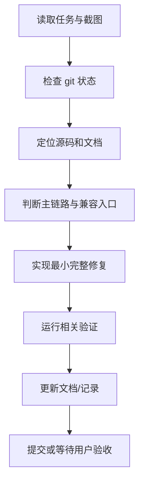

# AgentHub AI 协作 Spec

## 1. 协作目标

AI 协作不是简单“让模型写代码”，而是建立一套可重复执行的工程协作协议：

1. 明确任务目标和验收标准。
2. 识别现有架构和约束。
3. 选择最小但完整的实现路径。
4. 运行必要验证。
5. 将经验沉淀为 Rules / Skills / Docs。

## 2. 任务输入规范

每个 AI 协作任务至少包含：

| 字段 | 说明 | 示例 |
| --- | --- | --- |
| 背景 | 为什么要做 | “部署链接为空白，演示无法通过” |
| 目标 | 做到什么程度 | “真实部署到可访问 URL” |
| 范围 | 哪些模块可改 | `backend/src/app/services/deployments.py`、`frontend/src/features/artifacts` |
| 约束 | 不能做什么 | “不要大改架构，不要假卡片” |
| 验收 | 怎么判断完成 | “打开部署 URL 能看到页面并调用 API” |

## 3. 开发流程 Spec

## 4. 交付物 Spec

每个较大任务完成后应至少提供：

- 代码改动。
- 验证方式。
- 影响范围说明。
- 剩余风险。
- 如涉及产品能力，更新相应文档。

## 5. 工程边界 Spec

| 类型 | 约定 |
| --- | --- |
| 后端主代码 | `backend/src` |
| 前端主代码 | `frontend/src` |
| 文档 | `docs` |
| 旧代码 | `backend/app-old` 仅历史参考，不新增实现 |
| 工具结果 | 不能只在前端假造，必须后端持久化 |
| 产物 | 必须有真实 Artifact / File / Deployment 记录 |
| 权限 | Tool / Skill / MCP / External Agent 必须走授权和审计 |

## 6. 验收 Spec

### 功能验收

- 单聊和群聊都能稳定回复。
- Agent 工具调用有真实执行记录。
- 产物卡片能打开、预览、下载。
- 工作区文件能看到上传、产物、沙箱、部署生成的文件。
- 部署链接能真实打开页面。

### 架构验收

- 路由薄，业务逻辑在 services。
- Agent Runtime、Workflow、Tools、Artifacts、Files、Deployments 边界清楚。
- 旧入口只做兼容 shim。
- 不把临时逻辑堆到大文件。

### 文档验收

- README / docs 能说明如何启动、如何演示、如何扩展。
- 本目录能说明 AI 协作流程和产物地址。

