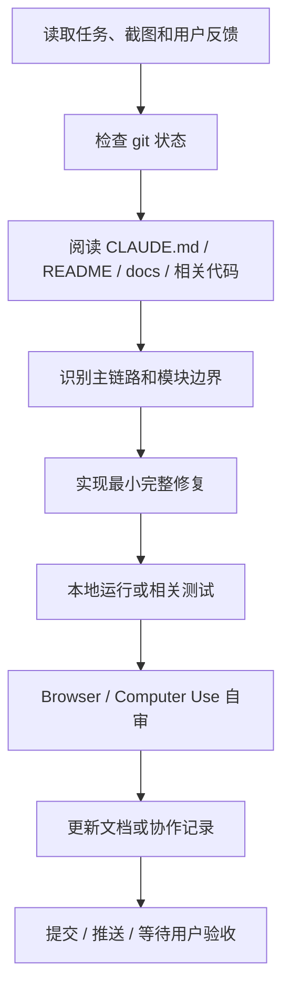

# AgentHub AI 编程协作 Spec

## 1. 协作目标

AI 协作不是简单“让模型写代码”，而是建立一套可重复执行的工程协作协议：

1. 人类负责人明确任务目标、验收标准和产品取舍。
2. Codex 读取仓库、文档、截图、日志和 Git 状态，理解当前系统。
3. Codex 在架构边界内实现或修复，避免把逻辑堆进旧入口。
4. 通过本地运行、Browser、Computer Use、测试和 Git 历史进行验证。
5. 将稳定经验沉淀为 Rules、AI 编程 Skills、Prompt 模板和文档。

## 2. 任务输入规范

每个 AI 协作任务至少包含：

| 字段 | 说明 | 示例 |
| --- | --- | --- |
| 背景 | 为什么要做 | “部署链接返回 200，但页面空白，演示无法通过。” |
| 目标 | 做到什么程度 | “真实部署到可访问 URL，并能打开页面。” |
| 范围 | 哪些模块可改 | `backend/src/app/services/deployments.py`、`frontend/src/features/preview` |
| 约束 | 不能做什么 | “不要大改架构，不要生成假卡片，不要提交 .env。” |
| 验收 | 怎么判断完成 | “打开部署 URL 能看到页面，并能通过代理访问后端 API。” |
| 自审 | 是否需要真实操作 | “用 Browser / Computer Use 点击预览、切换会话、刷新恢复。” |

## 3. 开发流程 Spec

## 4. 交付物 Spec

较大任务完成后应至少提供：

- 代码改动。
- 验证方式。
- 影响范围说明。
- 剩余风险。
- 如涉及产品能力，更新相应文档。
- 如涉及 AI 协作评分，更新 `docs/ai-collaboration-record`。

## 5. 工程边界 Spec

| 类型 | 约定 |
| --- | --- |
| 后端主代码 | `backend/src` |
| 前端主代码 | `frontend/src` |
| 文档 | `docs` |
| 旧代码 | `backend/app-old` 仅历史参考，不新增实现 |
| 工具结果 | 不能只在前端假造，必须后端持久化 |
| 产物 | 必须有真实 Artifact / File / Deployment 记录 |
| 权限 | Tool / Skill / MCP / External Agent 必须走授权和审计 |
| 自审 | 复杂 UI 问题优先用 Browser / Computer Use 复现 |

## 6. 验收 Spec

### 功能验收

- 单聊和群聊都能稳定回复。
- Agent 工具调用有真实执行记录。
- 产物卡片能打开、预览、下载。
- 工作区文件能看到上传、产物、沙箱、部署生成的文件。
- 部署链接能真实打开页面。

### 架构验收

- 路由薄，业务逻辑在 services。
- Agent Runtime、Workflow、Tools、Artifacts、Files、Deployments 边界清晰。
- 旧入口只做兼容 shim。
- 不把临时逻辑堆到大文件。

### 自审验收

- 用 Browser / Computer Use 复查关键路径。
- 页面无明显白屏、错位、按钮无反馈。
- 切换会话和刷新后状态能恢复。
- 文件预览、产物预览、部署预览不静默失败。

### 文档验收

- README / docs 能说明如何启动、如何演示、如何扩展。
- 本目录能说明 AI 编程协作流程、技能资产和产物地址。
