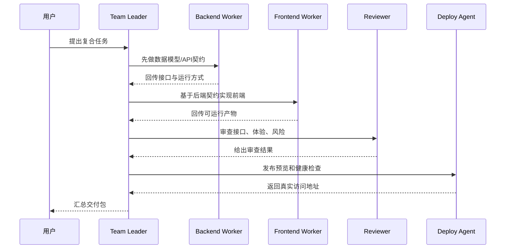

# AI 协作 Rules

## 1. 基础规则

1. 先读 `CLAUDE.md` 和相关 docs，再改代码。
2. 修改前先看 `git status`，不覆盖别人未提交改动。
3. 优先用现有架构和模块边界，不另起一套体系。
4. 不把业务逻辑塞进兼容 shim。
5. 不把真实密钥写入前端或文档。
6. 不把 mock 结果包装成真实成功。

## 2. 代码规则

| 场景 | 规则 |
| --- | --- |
| 后端服务 | 路由薄，业务进 `services` |
| 数据模型 | 模型变更配 Alembic |
| 工具调用 | ToolDefinition、权限、schema、ToolInvocation 缺一不可 |
| 产物生成 | Artifact / FileAsset / PreviewCard 必须真实关联 |
| 部署 | 没有真实访问地址不能声称 deployed |
| 前端状态 | 不能只靠本地状态，刷新后要能从 DB 恢复 |

## 3. AI 输出规则

1. 明确区分“已完成”“降级”“失败”“待用户配置”。
2. 用户要求生成文件时，Agent 必须优先调用真实工具。
3. 用户要求前后端项目时，应先产出后端接口契约，再让前端对接。
4. 部署 Agent 必须返回真实 URL、端口、健康检查或失败原因。
5. Reviewer 不能只夸赞，要检查完整性、风险和缺口。

## 4. 多 Agent 协作规则



## 5. 提交规则

推荐提交信息：

```text
feat(agenthub): add ...
fix(agenthub): repair ...
docs(agenthub): update ...
refactor(agenthub): split ...
```

提交前至少确认：

- `git diff --check`
- 相关文件 `ruff` / `build` / 轻量浏览器验证
- 无 `.env`、日志、缓存、数据库文件进入提交

