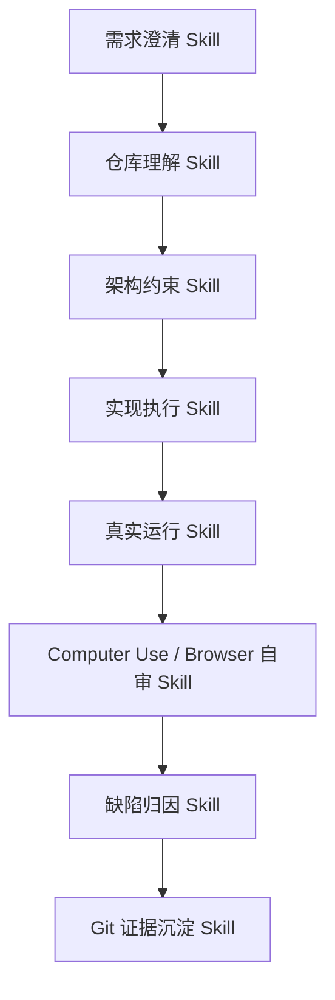

# AI 编程协作 Skills / Prompts 高级沉淀

> 本文中的 Skills / Prompts 指的是：项目负责人在使用 Codex、Computer Use、Browser、Git、自动化测试和本地运行环境开发 AgentHub 过程中沉淀出的 AI 编程协作方法，而不是 AgentHub 平台内部给业务 Agent 配置的 Skill 目录。  
> 目标是证明本项目并非简单“让 AI 写代码”，而是形成了一套可复用、可审计、可迁移的人机协同工程体系。

---

## 1. 方法论定位

AgentHub 本身是一个多 Agent 协作平台，而 AgentHub 的开发过程也采用了类似“人类负责人 + Codex 工程 Agent + 浏览器/桌面自审 + Git 证据链”的协作方式。

在这个过程中，人的角色不是被动等待 AI 输出，而是持续承担：

- 产品方向定义者：持续明确 AgentHub 应该对标 IM 工作台、工作流平台、AI IDE、工具执行平台中的哪些能力。
- 质量裁判：通过截图、运行日志、真实操作反馈指出“能跑但不好用”“看似成功但是假产物”“状态不同步”等体验问题。
- 协作调度者：把大型需求拆成多个可执行阶段，要求 Codex 按模块边界、文档规范和 Git 规则推进。
- 验收用户：亲自打开本地页面、发送消息、点击预览、上传文件、运行工作流，以真实使用体验驱动修复。

Codex 的角色则逐步从“代码补全工具”升级为：

- 架构理解助手
- 全栈实现工程师
- 多轮缺陷定位器
- 文档整理者
- Git 协作执行者
- Browser / Computer Use 自审执行器

这种协作模式的核心不是一次性 Prompt，而是持续迭代的“AI 工程协作操作系统”。

---

## 2. AI 编程协作 Skill 分层



| Skill 层级 | 具体能力 | 在 AgentHub 开发中的体现 |
| --- | --- | --- |
| 需求澄清 Skill | 将用户自然语言、截图、评审要点转化为工程任务 | 从“多 Agent 群聊像飞书一样”拆成会话列表、群聊成员、自动组织、产物预览、工作区文件等模块。 |
| 仓库理解 Skill | 阅读 README、CLAUDE.md、docs、代码入口和 Git 历史 | 每次改动前先确认当前主链路、旧入口 shim、新架构目录和未提交状态。 |
| 架构约束 Skill | 不把功能堆进旧文件，按服务领域拆分 | Tool / Skill / MCP / external_agents / workflow / context / runtime 等保持边界。 |
| 实现执行 Skill | 以最小完整闭环实现功能，不停留在方案 | 真实完成文件上传、产物生成、部署预览、工作流画布、外部 Agent 接入等功能。 |
| 真实运行 Skill | 启动前后端、迁移数据库、运行 uv/pnpm/test | 使用 `uv run`、`pnpm`、Alembic、pytest、Vitest、浏览器本地验证。 |
| Computer Use / Browser 自审 Skill | 用真实 UI 操作、截图和浏览器行为发现问题 | 通过 in-app browser / Computer Use 检查白屏、错位、点击无反应、预览失败、状态不同步。 |
| 缺陷归因 Skill | 不只改 UI 表象，而是追踪事件、API、DB、运行态 | 例如从“卡片点击无反应”追到 rawContent.artifact_id、artifact API、右侧预览状态。 |
| Git 证据沉淀 Skill | 分支、提交、合并、文档记录和可追溯历史 | 形成 main / fix 分支、按主题提交，并在文档中记录关键协作过程。 |

---

## 3. Codex 协作技能资产

本节是方法论说明；对应的可复用 Skill 形态已经单独沉淀到 [`skills/`](./skills/) 目录中。每个子目录都包含标准 `SKILL.md`，覆盖产品简报、仓库理解、架构审查、前端体验、自审验收、真实产物、能力审计、多 Agent 运行时、部署预览、Git 证据和评审包装等场景，可作为评审材料，也可以迁移到 Codex Skills 目录中进一步产品化。

### 3.1 Repo-aware Development Skill

**目标**：让 Codex 在修改前先理解仓库，而不是凭空生成代码。

使用方式：

```text
请先阅读 CLAUDE.md、README.md、docs/backend-architecture.md、docs/functional-guide.md，
确认当前主链路和模块边界，再进行修改。
不要使用旧 backend/app-old，不要把新功能堆进旧 orchestrator 或 tool_registry。
```

在 AgentHub 中的沉淀：

- `backend/src` 是后端唯一主目录。
- `frontend/src` 是前端唯一主目录。
- `backend/app-old` 只保留历史参考。
- 旧入口只允许做兼容 shim，新业务必须进入新服务结构。
- 文档必须与当前代码主链路一致，不能描述已经废弃的运行方式。

### 3.2 Architecture Guardrail Skill

**目标**：防止 AI 为了快速完成把复杂能力堆进一个文件。

典型 Prompt：

```text
请按 CLAUDE.md 规范实现。
不要大改架构，不要把逻辑塞进一个大文件。
如果是工具能力，放到 services/tools；
如果是外部 Coding Agent，放到 services/external_agents；
如果是上下文和记忆，放到 services/context；
如果是群聊运行时，放到 agent_runtime。
旧入口只保留兼容 shim。
```

对 AgentHub 的价值：

- Tool / MCP / Skill 从混乱 registry 拆成清晰领域。
- External Coding Agent 没有塞进 sandbox，而是独立 adapter。
- 工作流没有成为前端假画布，而是绑定 conversation workflow 和 WorkflowRun。
- 文件系统没有只是上传接口，而是 workspace 级文件树和文件地图。

### 3.3 Real Artifact Skill

**目标**：所有产物必须是真文件、真链接、真记录，不允许“口头完成”。

典型 Prompt：

```text
用户要求生成 PDF / Word / HTML / 项目时，
不能只回复正文，必须真实调用 artifact 或文件工具。
成功标准是：
1. 有 Artifact 记录；
2. 有真实 source/export 文件；
3. 有 preview_card 消息；
4. 有可打开的 preview_url；
5. 有可下载的 export_url；
6. 刷新后仍然存在。
```

沉淀出的规则：

- “Agent 说已经生成”不等于成功。
- “部署状态 deployed”不等于有可访问 URL。
- “前端写好了”不等于工作区文件可见。
- “工具调用成功”必须能落到 ToolInvocation、Artifact、FileAsset 或 Deployment。

### 3.4 Streaming And State Consistency Skill

**目标**：让 Codex 不只修“能回复”，还要修流式体验和状态收敛。

典型 Prompt：

```text
不要用补拉消息掩盖流式问题。
message_stop 只结束单条消息；
generation_finished / cancelled 才结束全局 running。
切换会话后流式状态不能丢失。
前端不能短暂显示两条再合并。
```

在 AgentHub 中的应用：

- 修复左侧“正在回答”僵尸状态。
- 修复切换会话后消息不显示、流式中断、回复瞬间出现。
- 修复思考模式按发送时状态持久化，而不是全局开关 retroactively 影响历史消息。
- 修复多 Agent 回复在流式过程中互相覆盖的问题。

### 3.5 Multi-agent Coordination Skill

**目标**：让多 Agent 协作不再盲目并行，而是按依赖链推进。

典型 Prompt：

```text
多 Agent 群聊默认使用自动组织。
Team Leader 需要根据任务决定调度顺序。
前后端项目应先 Backend Worker 产出 API 契约，
再让 Frontend Worker 基于契约实现页面，
最后 Deploy Agent 基于真实项目入口给出预览地址。
不要所有 Agent 第一轮同时抢答。
```

沉淀出的协作原则：

- 简单问候：只需要一个合适 Agent 回复。
- 文件总结：由具备文件能力的 Agent 处理。
- 前后端项目：后端先行，前端依赖后端，部署最后。
- 文档说明：通常在实现完成后再由写作/Team Leader 汇总。
- Reviewer：不负责主产物生成，只做质量门禁。

### 3.6 Computer Use Self-review Skill

**目标**：让 AI 不停留在“代码看起来对”，而是像真实用户一样操作界面。

在本项目中，Computer Use / Browser 自审承担了三个角色：

1. **视觉审查**：检查页面白屏、错位、卡片重叠、按钮无反馈、工作流节点不可编辑。
2. **交互审查**：模拟点击预览产物、上传文件、切换会话、运行代码块、打开工作区文件。
3. **状态审查**：观察流式回复是否中断、思考块是否按消息保存、running 是否收敛。

典型 Prompt：

```text
请像真实用户一样操作本地页面：
1. 打开当前会话；
2. 发送消息；
3. 点击产物卡片；
4. 检查右侧预览是否打开；
5. 切换到其他会话再切回来；
6. 观察消息、思考块、running 状态是否一致。
不要只看代码判断完成。
```

这种自审机制让很多“后端 200 但前端无事发生”的问题被发现，例如：

- 工作流画布输入框刚输入又恢复。
- 产物卡片点击无反应。
- HTML 预览显示源码而不是运行效果。
- 文件上传失败但上下文仍残留。
- 外部 Agent 设置页首次进入 500。

### 3.7 Git Evidence Skill

**目标**：用 Git 历史证明 AI 协作不是一次性输出，而是长期工程迭代。

协作方式：

- 每轮功能完成后形成主题提交。
- 大改动先分支，稳定后合并 main。
- 文档、测试、代码尽量同主题提交。
- 对评审关心的 AI 协作过程单独沉淀 `docs/ai-collaboration-record`。

可引用的历史提交片段：

| Commit | 说明 | 对应协作能力 |
| --- | --- | --- |
| `a48bc9e fix(agenthub): make tech lead scheduling dependency-aware` | 优化 Team Leader 依赖调度 | 多 Agent 编排 Skill |
| `55fbb51 fix(agenthub): sequence fullstack multi-agent delivery` | 前后端项目按依赖顺序交付 | 协作链路设计 Skill |
| `22b80d3 fix(agenthub): enforce project delivery previews` | 强化项目交付预览 | 真实产物 Skill |
| `84217eb fix(agenthub): stop templated html fallback` | 移除死模板 HTML 兜底 | 质量约束 Skill |
| `6e4b9ba feat: add interactive terminal tools` | 引入交互式终端工具 | 工具能力扩展 Skill |
| `07c6513 feat: unify external agent invocation` | 统一外部 Coding Agent 调用 | 外部 Agent 接入 Skill |
| `dfce17a fix(external-agents): auto approve cli permissions` | Codex / Claude Code 默认自动确认 | 外部 Agent 权限策略 Skill |
| `e306e52 fix(context): restore Chinese memory prompts` | 修复中文记忆提示 | 上下文质量 Skill |
| `4a22321 fix(agenthub): stabilize fullstack deployment previews` | 稳定全栈部署预览 | 部署验收 Skill |
| `cec56f3 docs(agenthub): add ai collaboration record package` | 新增 AI 协作记录包 | 文档沉淀 Skill |

---

## 4. Prompt 协议沉淀

### 4.1 大型功能实现协议

```text
你是资深全栈工程负责人。
请先阅读当前仓库文档和相关代码，再直接实现，不只输出计划。

要求：
1. 遵循 CLAUDE.md。
2. 不破坏现有 API、数据库模型和前端行为。
3. 保持模块边界清晰，不写超长文件。
4. 所有工具、产物、部署必须真实可追踪。
5. 实现后运行必要验证。
6. 最终说明改了什么、为什么、如何验证、剩余风险。
```

适用场景：

- 后端服务结构重构。
- 工作流画布升级。
- Tool / Skill / MCP 能力体系整理。
- 多 Agent actor runtime 改造。
- 产物生成与部署链路修复。

### 4.2 缺陷定位协议

```text
请不要只修 UI 表象。
按链路排查：
用户操作
  -> 前端事件
  -> API / WebSocket / SSE
  -> 后端服务
  -> 数据库记录
  -> 前端状态合并
  -> 刷新恢复

修复后必须说明根因属于：
1. 前端事件未触发；
2. API 响应错误；
3. 后端未持久化；
4. SSE / WebSocket 事件语义错误；
5. 前端 merge 逻辑错误；
6. 历史兼容数据缺失。
```

典型应用：

- 预览卡片点击无反应。
- 工作流运行一直 5%。
- 切换会话后回复消失。
- 群聊第二轮不回复。
- 文件上传后 Agent 说没收到文件。

### 4.3 真实交付协议

```text
如果用户要求“生成/部署/运行/上传/预览”，
不能只生成自然语言解释。

成功标准必须落到至少一种持久记录：
- Message
- ToolInvocation
- Artifact
- FileAsset
- Deployment
- WorkflowRun
- ExternalAgentRun
- SandboxSession

如果没有真实记录，不允许声称完成。
```

这条协议是 AgentHub 迭代中最重要的质量基线之一，直接解决了：

- “Agent 说生成 PDF，但没有文件”。
- “Agent 说已部署，但 URL 空白”。
- “Agent 说写好了代码，但工作区文件看不到”。
- “Team Leader 汇总了不存在的产物”。

### 4.4 Browser / Computer Use 验收协议

```text
请用本地浏览器或 Computer Use 做用户级验收：
1. 打开页面；
2. 执行用户操作；
3. 截图观察视觉状态；
4. 检查 console / network；
5. 切换页面或刷新验证恢复；
6. 不通过就回到代码修复。
```

验收重点：

- 点击是否有反馈。
- 文案是否乱码。
- 布局是否错位。
- 右侧预览是否真实展示。
- 下载是否是正确格式。
- 运行状态是否按会话清理。
- AI 回复是否按流式显示。

### 4.5 文档沉淀协议

```text
每完成一个大阶段，请同步更新文档：
- 功能说明写入 functional-guide；
- 架构边界写入 backend-architecture；
- 文件位置写入 file-map；
- 状态和限制写入 implementation-status；
- AI 协作证据写入 ai-collaboration-record。
```

这样做的价值：

- 评审能从文档理解系统，而不是只看页面。
- 后续开发不会反复踩旧坑。
- AI 协作过程可追溯、可复盘、可复用。

---

## 5. 可复用 Prompt 模板

### 5.1 架构型任务模板

```text
请按 CLAUDE.md 规范，基于当前仓库结构实现 <功能>。

边界：
- 不改无关功能；
- 不新增大而全的单文件；
- 旧入口只保留 shim；
- 核心逻辑迁移到 <目标领域目录>；
- 保持 API 和前端行为兼容。

验收：
- 代码结构清晰；
- 数据可持久化；
- 前端可操作；
- 失败有明确错误；
- 文档同步更新。
```

### 5.2 多 Agent 调度优化模板

```text
请优化多 Agent 自动组织。

要求：
- Team Leader 是调度者，不是隐藏执行者；
- 只调度当前群聊成员；
- 简单问题不要全员抢答；
- 前后端项目按 Backend -> Frontend -> Deploy -> Summary；
- 文档和 Reviewer 放在实现之后；
- 每个 Agent 的输出进入 Blackboard；
- 最终总结只能引用真实产物和运行记录。
```

### 5.3 产物生成修复模板

```text
请修复产物生成链路。

要求：
- Agent 有权限时必须调用真实 artifact 工具；
- 工具成功后必须创建 Artifact 和 preview_card；
- preview_card 必须包含 artifact_id、preview_url、export_url、format、filename；
- 右侧预览必须使用真实 artifact；
- 下载必须下载主格式文件；
- 失败不创建假卡片。
```

### 5.4 状态同步修复模板

```text
请修复聊天状态同步。

要求：
- message_stop 只结束单条消息；
- generation_finished / cancelled 才清理全局 running；
- 切换会话不丢失流式消息；
- 页面刷新后以后端状态为准；
- 不允许 setTimeout 伪修复；
- 补充异常路径状态收敛。
```

### 5.5 自审复盘模板

```text
请像真实用户一样验证：
- 发送消息；
- 切换会话；
- 点击产物；
- 上传文件；
- 打开工作区文件；
- 运行工作流；
- 部署预览；
- 刷新恢复。

如果发现问题，请按链路定位根因，修复后再复测。
```

---

## 6. 人机协作分工模式

### 6.1 人类负责人负责什么

- 判断产品体验是否符合预期。
- 提供截图、现象、反例和优先级。
- 决定架构方向，例如“Web 主力，三端同步”“默认自动组织而不是默认工作流”。
- 决定哪些功能不能简化为 Demo。
- 要求 Codex 遵守分支、提交、文档和测试规则。

### 6.2 Codex 负责什么

- 阅读和理解代码库。
- 按现有架构实现功能。
- 修复跨前后端问题。
- 维护文档和 Git 历史。
- 启动服务、运行迁移、检查状态。
- 借助 Browser / Computer Use 做自审。

### 6.3 Computer Use / Browser 负责什么

- 站在真实用户视角验证。
- 检查视觉和交互细节。
- 发现“代码正确但体验失败”的问题。
- 辅助定位前端事件、控制台错误和页面状态。

### 6.4 Git 负责什么

- 保存每个阶段的工程证据。
- 支撑评审中的“AI 协作过程记录”。
- 让每个能力的演进可追溯。
- 作为人机协作复盘的数据源。

---

## 7. 典型协作闭环案例

### 7.1 产物预览卡片从假到真

早期问题：

- Agent 口头说“已生成 PDF”。
- 前端出现卡片，但没有真实 artifact_id。
- 点击预览无反应或右侧空白。

协作过程：

1. 人类通过截图指出“没有真实预览”。
2. Codex 追踪 message rawContent、artifact API、preview panel。
3. 后端补 Tool Result -> preview_card 映射。
4. Artifact 工具返回真实 artifact_id、preview_url、export_url。
5. 前端点击卡片按 artifact_id 拉取真实产物。
6. 文档补充“不能生成假产物”的边界。

沉淀 Skill：

- Real Artifact Skill
- Defect Trace Skill
- Browser Self-review Skill

### 7.2 多 Agent 从抢答到依赖调度

早期问题：

- 前端、后端、部署 Agent 同时并行回复。
- 前端没有拿到后端 API 契约就开始写页面。
- Deploy Agent 没有真实 URL 却声称部署成功。

协作过程：

1. 人类指出“前端应该根据后端产物处理”。
2. Codex 调整 scheduler prompt 和 dependency-aware strategy。
3. Backend Worker 先输出 API、文件、启动方式。
4. Frontend Worker 基于 API 写页面。
5. Deploy Agent 基于真实项目入口生成预览地址。
6. Team Leader 汇总链路、产物、风险。

沉淀 Skill：

- Multi-agent Coordination Skill
- Contract-first Backend Skill
- Contract-aware Frontend Skill
- Deployment Readiness Skill

### 7.3 UI 体验从代码判断到真实操作

早期问题：

- 工作流画布输入框无法编辑。
- 文件地图重复展示。
- 预览面板按钮含义不清。
- 切换会话后消息状态错乱。

协作过程：

1. 人类通过截图和操作描述反馈。
2. Codex 用 Browser / Computer Use 思路复现。
3. 从前端状态、路由、组件 props、后端 API 逐层定位。
4. 修复后再次通过页面行为验证。

沉淀 Skill：

- Computer Use Self-review Skill
- UI State Debug Skill
- Interaction Acceptance Skill

---

## 8. 高级 Prompt 质量标准

一个高质量 AI 编程 Prompt 应满足：

1. **目标明确**：说清楚最终用户要看到什么。
2. **边界明确**：说明哪些模块能改，哪些不能动。
3. **成功标准明确**：用可运行、可预览、可下载、可刷新恢复定义完成。
4. **数据链路明确**：要求落到 DB、文件、运行记录，而不是口头结果。
5. **失败策略明确**：失败要报错、降级或停止，不能假成功。
6. **架构约束明确**：避免把新逻辑堆到旧入口或大文件。
7. **验证路径明确**：说明是否需要测试、浏览器验证、截图检查或 Git 提交。

不合格 Prompt 示例：

```text
把页面优化一下。
```

合格 Prompt 示例：

```text
请修复工作区文件页面的文件地图展示：
1. 文件地图不要常驻占用空间，改成按钮打开弹窗；
2. 弹窗用竖向树状图展示目录；
3. 新建文件夹后必须同时出现在文件地图和文件树；
4. 不要改后端文件权限逻辑；
5. 完成后说明改动文件和剩余风险。
```

---

## 9. 可产品化方向

这套 AI 编程协作资产可以继续产品化为 AgentHub 自身能力：

1. **AI 协作记录自动生成**  
   根据 Git commit、ToolInvocation、Artifact、Deployment 自动生成协作报告。

2. **Codex / Claude Code 项目 Agent**  
   将外部 Coding Agent 接入为可授权的长任务 Agent，自动记录 changed_files 和运行结果。

3. **Computer Use 自审 Agent**  
   用 Browser / Computer Use 自动执行点击、预览、上传、切换会话等验收脚本。

4. **Prompt Library**  
   将本文中的 Prompt 协议沉淀为可选模板，供不同项目复用。

5. **AI 协作评分面板**  
   统计 Spec、Rules、Skill、Prompt、产物、测试、提交历史，形成评审可视化证据。

---

## 10. 结论

AgentHub 的开发过程本身就是一次高强度 AI 编程协作实践：

- 人类负责目标、审美、质量和验收。
- Codex 负责跨前后端实现、调试、文档和 Git 操作。
- Computer Use / Browser 负责把代码结果拉回真实用户体验。
- Git 历史和文档包负责把协作过程变成可审计证据。

因此，本项目沉淀的 Skills / Prompts 不只是提示词，而是一套可复用的 AI 工程协作方法：以真实产品目标为牵引，以架构边界为约束，以运行结果为证据，以反复自审为质量保障。
