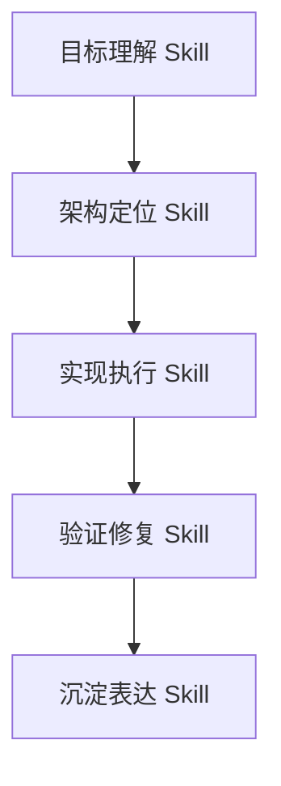

# Skills / Prompts 高级沉淀

> 本文不是简单罗列提示词，而是将 AgentHub 开发过程中形成的 AI 协作技能、提示协议、角色分工和复盘机制整理为可复用资产。

## 1. 协作技能体系

AgentHub 的 AI 协作技能可以分为五层：



| 层级 | 能力 | 目标 |
| --- | --- | --- |
| 目标理解 Skill | 从自然语言、截图和历史需求中抽取目标、约束、验收标准 | 避免 AI 只做表面功能 |
| 架构定位 Skill | 读取代码、文档、git 状态，判断主链路和兼容入口 | 避免把逻辑堆到错误位置 |
| 实现执行 Skill | 按模块边界修改代码，补齐数据流、权限、状态和 UI | 形成真实可运行功能 |
| 验证修复 Skill | 用日志、Playwright、接口、数据库和轻量测试定位问题 | 修到体验可用 |
| 沉淀表达 Skill | 将经验整理成 Spec、Rules、Prompt、文档和演示说明 | 形成可复用协作资产 |

## 2. Agent 角色能力模型

### 2.1 Team Leader / Scheduler

**定位**：不是隐藏最高权限，而是当前群聊里的调度型 Agent。

**核心技能**：

- 判断任务是闲聊、单 Agent、协同项目还是工作流任务。
- 识别依赖关系：后端接口先于前端联调，产物生成先于部署，审查在交付前。
- 生成阶段计划：阶段、目标 Agent、预期输出、依赖、风险。
- 汇总 Blackboard 中的 Agent 输出，形成最终验收说明。

**高质量提示原则**：

```text
你是 Team Leader，不是万能执行者。
你只能调度当前群聊成员，不能绕过成员权限。
对于前后端分离项目，先指派 Backend Worker 产出 API 契约和运行说明；
再指派 Frontend Worker 基于上游契约实现页面；
最后指派 Deploy Agent 基于真实产物部署预览。
如果某一阶段没有真实产物或运行记录，必须标记风险，不能声称完成。
```

### 2.2 Backend Worker

**定位**：服务接口、数据模型、运行脚本和后端验证。

**核心技能**：

- 设计数据模型和 API 契约。
- 写入工作区后端文件。
- 生成 `README.md`、`requirements.txt`、启动命令和接口文档。
- 使用 sandbox / terminal 工具做基本运行验证。
- 输出给前端可消费的接口契约，而不是只给自然语言描述。

**输出结构建议**：

```text
后端交付：
1. 文件位置
2. 数据模型
3. API 契约
4. 启动方式
5. 验证结果
6. 给 Frontend Worker 的对接说明
```

### 2.3 Frontend Worker

**定位**：用户可见界面、交互体验、对接后端 API、生成真实前端产物。

**核心技能**：

- 读取后端上游输出。
- 基于 API 契约实现页面，而不是凭空写死假数据。
- 写入 `index.html` 或前端项目目录。
- 通过 `artifact.create_html` 或部署工具形成可预览产物。
- 如果后端暂不可用，应明确“演示模式”和“真实后端模式”的差异。

**高质量提示原则**：

```text
你必须基于 Backend Worker 的接口契约实现前端。
不要把需求标题直接当页面标题填充模板。
如果是游戏、管理系统、看板等应用，必须有真实交互状态和可操作界面。
如果需要后端数据，必须写清 API_BASE_URL、接口路径和降级策略。
```

### 2.4 Reviewer

**定位**：质量门禁，不负责生成主要产物。

**核心技能**：

- 检查需求覆盖。
- 检查前后端契约一致性。
- 检查工具/产物/部署是否真实。
- 检查权限、安全、失败路径。
- 输出阻断项与非阻断优化项。

**审查输出建议**：

```text
审查结论：
- 通过 / 有条件通过 / 不通过

阻断项：
- ...

非阻断优化：
- ...

验收建议：
- ...
```

### 2.5 Deploy Agent

**定位**：发布、运行验证、可访问地址和失败原因说明。

**核心技能**：

- 使用真实 artifact_id 发布预览。
- 对静态 HTML 提供部署 URL。
- 对全栈项目检测后端入口并尝试启动服务。
- 将前端 API 地址改为部署代理地址，避免 CORS 和 localhost 错配。
- 输出真实 URL、端口、健康检查、失败原因。

**禁止行为**：

- 没有访问地址却声称“已部署”。
- 只说“可以手动运行”，但不给部署状态。
- 把 artifact preview URL 和 deployment site URL 混淆。

## 3. Prompt 协议模板

### 3.1 复杂工程任务协议

```text
请按 CLAUDE.md 和当前架构文档处理这个任务。

任务目标：
- <用户真实目标>

必须遵守：
- 不生成假产物。
- 不把新逻辑塞进旧 shim。
- 所有工具结果必须可追踪。
- 如果涉及多 Agent，按依赖链调度，不盲目并行。

建议执行顺序：
1. 读取相关文档和代码。
2. 判断主链路。
3. 实现最小完整闭环。
4. 轻量验证核心路径。
5. 更新文档或记录剩余风险。

最终说明：
- 改了什么
- 为什么这样改
- 如何验证
- 剩余风险
```

### 3.2 多 Agent 项目交付协议

```text
用户请求生成一个前后端项目。

Team Leader 必须先做任务规划：
- 判断是否需要后端、前端、文档、部署。
- 识别依赖顺序。
- 不要把所有 Agent 同时派出去抢答。

Backend Worker：
- 先交付数据模型、API 契约、后端文件和启动方式。

Frontend Worker：
- 必须读取 Backend Worker 的接口契约。
- 生成真实可运行前端文件。
- 需要预览时创建真实 HTML/Web Artifact。

Deploy Agent：
- 基于真实 artifact_id 或项目入口部署。
- 返回真实访问 URL。

Team Leader：
- 汇总每个 Agent 的产物、路径、地址和风险。
```

### 3.3 缺陷定位协议

```text
请不要只从 UI 表面修。

需要排查：
1. 前端事件是否触发。
2. API / WebSocket / SSE 是否返回。
3. 后端服务是否持久化状态。
4. 数据库记录是否正确。
5. 浏览器 console 是否报错。
6. 刷新后是否能恢复。

修复要求：
- 找到根因。
- 做最小完整修复。
- 如果是体验问题，用真实浏览器验证。
- 不引入 setTimeout 之类掩盖问题的假修复。
```

### 3.4 产物生成协议

```text
用户要求生成 PDF / Word / PPT / Excel / HTML / 项目。

规则：
- 有工具权限时，必须调用 artifact.create_* 或相应项目生成工具。
- 成功标准不是“回复说已生成”，而是产生 artifact_id。
- preview_card 必须由后端持久化。
- export_url 必须能下载真实文件。
- 如果工具失败，必须说明失败原因，不创建假卡片。
```

### 3.5 部署协议

```text
用户要求部署或试用。

Deploy Agent 必须：
1. 找到真实 artifact_id 或项目入口。
2. 调用 deploy.preview 或部署服务。
3. 如果是全栈项目，尝试启动后端服务并配置代理。
4. 返回真实可访问 URL。
5. 说明健康检查结果。
6. 若失败，给出明确原因和下一步操作。
```

## 4. 高阶协作模式

### 4.1 “用户截图 -> 根因 -> 修复”模式

适用场景：

- 预览空白。
- 点击无反应。
- 工作流画布输入框恢复。
- 流式消息消失。

处理方式：

```text
截图现象
  -> 定位前端组件
  -> 捕获浏览器 console / network
  -> 跟踪后端 API / DB
  -> 修复数据流或状态流
  -> 用同一场景复测
```

### 4.2 “口头成功 -> 真实产物”模式

适用场景：

- Agent 说已经生成 PDF，但没有卡片。
- Agent 说已经部署，但没有 URL。
- Agent 说已经写文件，但工作区看不到。

处理方式：

```text
检查工具调用
  -> 检查 ToolInvocation
  -> 检查 Artifact / FileAsset / Deployment
  -> 检查 Chat Message rawContent
  -> 检查前端展示
```

### 4.3 “并行协作 -> 依赖调度”模式

适用场景：

- 前后端项目。
- 有 API 契约、UI 实现、部署验证依赖。
- 多 Agent 同时输出导致成果不一致。

处理方式：

```text
Team Leader 建立计划
  -> Backend Worker 产出接口
  -> Frontend Worker 基于接口实现
  -> Reviewer 检查一致性
  -> Deploy Agent 发布验证
  -> Team Leader 汇总
```

## 5. 可复用 Skill 设计

| Skill | 输入 | 处理 | 输出 |
| --- | --- | --- | --- |
| `requirement-to-plan` | 用户需求、群聊成员、工具权限 | 判断任务类型、拆阶段、识别依赖 | 调度计划、目标 Agent、预期产物 |
| `contract-first-backend` | 项目需求 | 数据模型、API 契约、后端入口、README | 后端项目文件和接口说明 |
| `contract-aware-frontend` | 后端契约、UI 需求 | 页面实现、API 对接、降级演示模式 | 前端项目文件和 preview artifact |
| `artifact-integrity-check` | artifact_id、文件、preview_card | 校验文件、预览、导出、DB 记录 | 产物可用性报告 |
| `deployment-readiness` | artifact_id 或项目目录 | 静态发布、后端启动、代理注入、健康检查 | 部署 URL、端口、风险 |
| `runtime-state-debug` | 会话 ID、消息、事件日志 | 分析 message/generation/task/workflow 状态 | 状态收敛修复建议 |
| `feishu-delivery-pack` | Git 历史、文档、产物地址 | 汇总协作流程和证明材料 | 飞书文档草稿 |

## 6. Prompt 质量标准

一个高质量 AI 协作 Prompt 应满足：

1. **目标明确**：说明最终要看到什么，而不是只说“优化一下”。
2. **边界明确**：说明哪些模块能改，哪些不能动。
3. **成功标准明确**：说明如何判断完成。
4. **失败策略明确**：失败时要报错、降级还是停下。
5. **上下文充分**：提供截图、日志、路径、历史行为。
6. **约束真实**：不允许假产物、假部署、假工具调用。

## 7. 未来可产品化方向

1. 将这些 Prompt 模板内置为 AgentHub 的系统 Skill。
2. 每次多 Agent 协作自动生成一份协作报告。
3. 将 Git commit、ToolInvocation、Artifact、Deployment 关联成一条交付时间线。
4. 在飞书文档中自动同步最新产物地址和演示截图。
5. 将“人类验收反馈”沉淀为可搜索的问题库，供后续 Agent 调度时参考。

