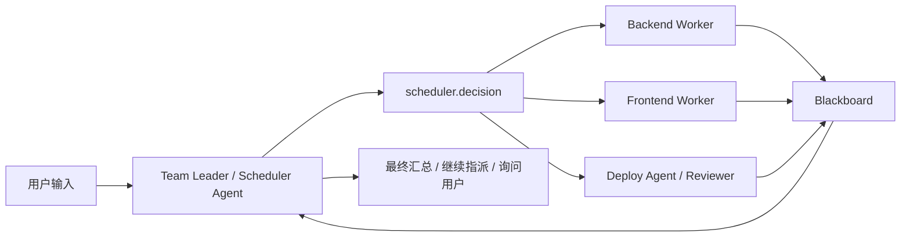
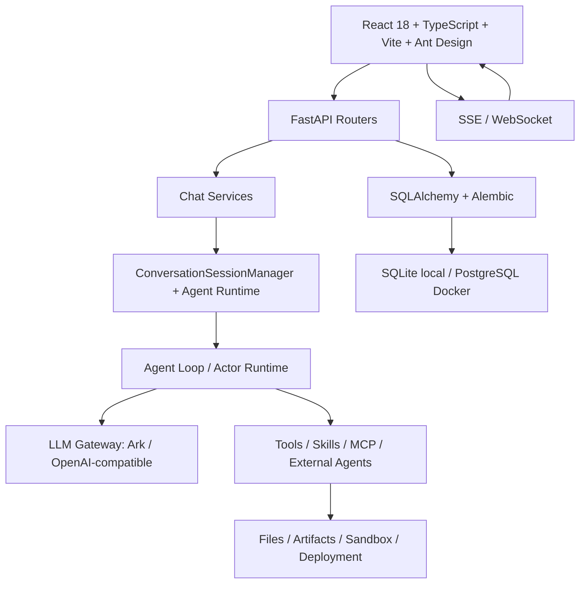

# AgentHub 多智能体协作工作台 - 产品设计文档

> 版本：V1.0  
> 面向场景：GitHub 发布、课程答辩、产品演示、后续迭代评审  
> 产品定位：IM 原生交互 + 多 Agent 自动组织 + Tool / Skill / MCP 能力执行 + 文件产物交付

---

## 一、产品概述

### 1.1 一句话定位

AgentHub 是一个以 IM 工作台为入口的多智能体协作平台：用户像在群聊里发任务一样组织 Agent，系统通过自动调度、工作流画布、工具调用、文件系统和产物预览，把「对话」推进成可运行、可预览、可下载、可部署的真实交付物。

### 1.2 产品愿景

AgentHub 希望把复杂的 Agent 编排能力隐藏在用户熟悉的聊天协作体验之后，让个人开发者、学生、教师和业务人员都能用自然语言驱动多个 AI 角色完成文档生成、文件处理、前后端项目开发、代码运行、部署预览和审查交付。

产品的核心不是再做一个普通 ChatBot，而是把 AI 能力产品化为一套可恢复、可审计、可扩展的协作工作台：

- 用户用 IM 会话表达目标。
- Agent 根据角色和权限独立行动。
- Scheduler / Team Leader 负责组织协作，不拥有隐藏最高权限。
- 工具、Skill、MCP 和外部 Coding Agent 负责把想法落到文件、代码、部署和记录。
- 所有产物都进入工作区文件系统和产物预览链路。

### 1.3 核心价值主张

| 价值主张 | 说明 |
| --- | --- |
| IM 原生上手 | 以左侧会话列表、中间聊天区、右侧预览区组织复杂 AI 工作，降低学习成本。 |
| 多 Agent 自动组织 | 默认群聊走 tech_lead actor runtime，由 Team Leader 根据任务动态指派合适 Agent。 |
| 真实工具闭环 | 文件、沙箱、产物、部署、外部 Coding Agent 都通过真实工具调用和运行记录交付。 |
| 可视化工作流 | 对确定流程可显式启用 Dify 风格画布，按节点和边执行 Agent / Tool / Skill / MCP。 |
| 产物即交付 | PDF、Word、PPT、Excel、HTML/Web App 等产物支持预览、编辑、Diff、导出和部署预览。 |
| 工作区资产沉淀 | 上传文件、沙箱文件、导出文件、项目文件和 Agent 产物统一进入工作区文件系统。 |
| 可扩展能力体系 | Tool / Skill / MCP / External Coding Agent 分层清晰，后续可持续接入外部能力。 |

### 1.4 产品边界

AgentHub 当前重点解决本地和演示环境中的多 Agent 协作与交付闭环：

- 支持本地/Docker 演示部署，不承诺生产级云原生编排。
- 支持本地沙箱和外部 CLI Agent，但生产隔离、资源配额和多租户安全仍属于后续部署工程。
- 支持 Web 主力工作台，桌面端和移动端以同步、轻量指令和查看为主。
- 支持真实模型和 Mock 降级，模型密钥只在后端配置和模型服务中保存。

---

## 二、目标用户与使用场景

### 2.1 用户画像

| 用户类型 | 典型诉求 | AgentHub 提供的价值 |
| --- | --- | --- |
| 高校学生 | 完成课程项目、实训作业、答辩演示 | 快速组织前端、后端、文档、部署 Agent，生成可演示项目和说明材料。 |
| 高校教师 / 评审 | 评估 AI 协作过程和交付质量 | 可查看协作记录、工具调用、产物地址、文件变化和文档沉淀。 |
| 全栈开发者 | 快速验证产品原型或内部工具 | 用群聊组织多角色分工，生成代码、运行沙箱、部署预览。 |
| 独立开发者 / 创业者 | 以低人力完成 MVP | 通过 Agent 广场、自定义 Agent、工具权限和工作流复用协作模式。 |
| 业务人员 | 生成报告、总结文件、制作演示页 | 上传文件后让 Agent 摘要、生成正式文档和可预览产物。 |

### 2.2 核心演示场景

| 场景 | 用户输入 | 系统输出 |
| --- | --- | --- |
| 日常单聊 | “帮我总结这个 PDF” | Agent 读取附件提取文本，输出摘要，文件进入工作区。 |
| 文档生成 | “生成一份项目方案 PDF” | 调用 artifact.create_pdf，生成真实 PDF、预览卡片和下载链接。 |
| HTML 应用 | “做一个计算器网页” | 生成真实 HTML/CSS/JS 文件，可右侧预览、下载和部署。 |
| 多 Agent 项目 | “生成前后端分离的数据管理项目” | 后端先输出 API 和服务，前端基于接口实现页面，部署 Agent 生成访问地址。 |
| 显式流程 | “按这个审批流程执行” | 启用 workflow 画布，按 start -> agent/tool/review -> end 执行。 |
| 外部 Coding Agent | “让 Codex 在项目目录里实现这个功能” | 通过 external_agent.invoke 运行外部 CLI，记录 stdout/stderr/changed files。 |

---

## 三、产品信息架构

### 3.1 功能模块总览

```text
AgentHub
├─ 账户与工作区
│  ├─ 登录 / 注册 / 演示用户
│  ├─ 工作区切换
│  ├─ 用户资料、头像、密码、模型设置
│  └─ 权限、审计、后台任务
├─ IM 协作工作台
│  ├─ 左侧会话列表、分类、置顶、归档、搜索
│  ├─ 单聊 Agent
│  ├─ 多 Agent 群聊
│  ├─ @Agent 指定响应
│  ├─ 流式回复、思考模式、取消、异步插队
│  └─ 可拖拽运行状态悬浮卡片
├─ Agent 中心
│  ├─ 官方 Agent
│  ├─ 用户自定义 Agent
│  ├─ 模型、工具、Skill、MCP 权限
│  └─ Agent 测试与编辑
├─ 自动组织运行时
│  ├─ Team Leader / Scheduler Agent
│  ├─ Actor runtime
│  ├─ Blackboard
│  ├─ Agent Context
│  └─ ConversationSessionManager
├─ 工作流画布
│  ├─ start / agent / tool / skill / mcp
│  ├─ condition / loop / review / artifact / end
│  ├─ AI 生成、拖拽、连线、配置、保存、启用
│  └─ WorkflowRun 节点状态恢复
├─ 能力体系
│  ├─ Tool：本地函数能力
│  ├─ Skill：能力包与运行策略
│  ├─ MCP：外部工具服务器
│  └─ External Coding Agent：Codex / Claude Code
├─ 文件与知识
│  ├─ 上传文件
│  ├─ 工作区文件树与文件地图
│  ├─ 文件预览 / 下载 / 重命名 / 删除 / 收藏
│  └─ 文件引用进入聊天上下文
├─ 产物与预览
│  ├─ PDF / DOCX / PPTX / XLSX / HTML
│  ├─ 预览卡片
│  ├─ 右侧预览、源码、Diff、部署、文件
│  └─ 导出与版本
└─ 部署预览
   ├─ 静态 HTML 站点
   ├─ source_download
   ├─ container / local preview
   ├─ 健康检查
   └─ 回滚记录
```

### 3.2 主界面布局

AgentHub 采用 IM 工作台布局：

| 区域 | 设计目标 | 关键能力 |
| --- | --- | --- |
| 顶部导航 | 全局上下文和入口 | 工作区选择、工作台、工作区文件、自动组织/工作流模式、设置、Agent 广场、文档。 |
| 左侧会话栏 | 会话组织 | 分类、置顶、归档、搜索、会话运行状态、未读状态、批量删除归档。 |
| 中间聊天区 | 协作主场 | 用户消息、Agent 流式回复、思考块、工具摘要、产物卡片、运行状态悬浮卡片。 |
| 右侧预览区 | 交付物处理 | 产物预览、源码、Diff、部署预览、文件与知识库，支持拖拽调宽。 |
| 工作流模式 | 编排视图 | 在当前聊天内容区切换为画布，不脱离 IM 工作台。 |
| 工作区文件 | 资产管理 | 文件树、文件地图、筛选、搜索、预览、下载、重命名、移动、删除。 |

---

## 四、核心功能设计

### 4.1 会话与 IM 协作

#### 单聊

单聊适用于明确找某个 Agent 完成任务，例如 Daily Chat Agent 做日常问答，Writing Agent 生成文档，Frontend Worker 做页面实现。

核心规则：

- 新建聊天默认选择 Daily Chat Agent，降低初始复杂度。
- 单聊走 `single_agent`，但复用统一 AgentLoop、工具执行器、消息持久化和产物映射。
- Agent 回复支持流式渲染；思考模式按“发送该消息时是否开启”决定是否长期显示思考块。
- 用户可以在上一个任务执行中继续发送消息，消息进入当前会话队列，不阻塞输入。

#### 群聊

群聊适用于需要多角色协作的任务，例如“生成前后端分离项目并给我可访问地址”。

核心规则：

- 新建群聊默认自动组织，不默认启用 workflow。
- `workflow_enabled=false` 时走 actor runtime，由 Team Leader 调度。
- `workflow_enabled=true` 时严格按当前会话 workflow 画布执行。
- `@Agent` 命中明确成员时只调度指定 Agent，除非用户明确要求全员协作。
- 多 Agent 输出必须保留真实身份，不允许合并成一个无来源的泛化回复。

### 4.2 自动组织运行时

自动组织是 AgentHub 群聊的默认主体验。它不等于传统“主控 Agent 包办一切”，而是一个事件驱动的协作 runtime。



设计要点：

- Scheduler Agent 是真实 Actor，订阅用户输入、Agent 报告、黑板更新和失败事件。
- Scheduler 决策包含 action、target_agent_ids、task、rationale、expected_outputs、requires_review。
- Backend / Frontend / Deploy / Reviewer 等 Agent 只在被指派时执行，不能越权调用非授权工具。
- 复杂任务应支持依赖关系：后端先给 API 契约，前端基于 API 实现，部署在可运行产物之后执行，文档通常在交付后汇总。
- 简单问候不需要 Team Leader 再次总结。

### 4.3 工作流画布

工作流是显式启用后的事实来源，用于用户希望固定流程、可视化编排或重复执行的场景。

支持节点：

- start
- agent
- tool
- skill
- mcp
- condition
- loop
- review
- artifact
- end

关键交互：

- 画布绑定当前 conversation.extra.workflow，不是工作区全局画布。
- 保存画布不等于启用画布；启用后才切换到 workflow strategy。
- 节点支持拖拽、连线、删除、复制、基础配置、输入输出映射。
- 运行态写入 WorkflowRun.node_states，刷新后可恢复。
- 运行失败必须给出明确错误，不能停留在人工进度。

### 4.4 Tool / Skill / MCP 能力体系

#### Tool

Tool 是可执行函数能力，负责真实落地：

- file.read / file.write / file.extract_text / file.preview
- artifact.create_pdf / create_docx / create_pptx / create_xlsx / create_html
- sandbox.run / test.run / api.test
- browser.preview
- deploy.preview
- external_agent.invoke

所有 Tool 调用必须经过：

1. 工具目录可用性检查。
2. Agent 授权检查。
3. 用户权限检查。
4. JSON Schema 参数校验。
5. 执行记录写入 ToolInvocation。
6. 结果映射到消息、产物、文件或运行日志。

#### Skill

Skill 是 Agent 能力包，不是把所有工具实现塞进 Prompt：

- 支持 manifest、runtime、entry、input_schema、output_schema、dependencies、permissions、tests。
- 旧技能数据通过 legacy adapter 兼容。
- SkillRuntime 统一负责输入校验、依赖检查、运行记录和标准结果回传。

#### MCP

MCP 是外部工具服务器接入层：

- 支持服务器注册、探测、工具发现、调用记录和错误处理。
- 不可用时返回 degraded/failure，不假装成功。
- MCP 调用仍受 Agent 工具权限和运行记录约束。

### 4.5 外部 Coding Agent

Codex / Claude Code 作为外部长任务 Coding Agent 接入，不是一次性小工具。

设计原则：

- 通过 `services/external_agents` adapter 层接入。
- 暴露统一工具 `external_agent.invoke`，支持 probe/run/status/cancel。
- 默认非交互权限确认：Codex 使用 full-auto，Claude Code 跳过内部确认，但 AgentHub 仍做权限、路径、记录和脱敏。
- CWD 限制在当前 workspace / conversation / project 安全目录。
- 未安装 CLI 时显示 degraded 状态，不假装运行成功。

### 4.6 文件系统与知识上下文

工作区文件系统是 AgentHub 的资产底座。

目录归一：

| 来源 | 目录 |
| --- | --- |
| 上传附件 | uploads |
| Agent 产物 | artifacts |
| 沙箱生成 | sandbox |
| 导出文件 | exports |
| 项目文件 | projects |
| 兼容旧数据 | legacy / compatibility display |

核心能力：

- 树表布局展示文件名、路径、来源、大小、修改时间、操作。
- 文件地图以树状图方式展示目录结构。
- 支持预览、下载、重命名、移动、收藏、删除、批量删除。
- `@file(path file_id=xxx)` 可加入聊天上下文。
- 文本、Markdown、HTML、图片、PDF 支持在线预览；Office 优先转 PDF，失败时给出下载入口和清晰原因。

### 4.7 产物生成、预览与部署

产物是 AgentHub 的交付中心。所有产物卡片必须来自真实工具结果，而不是前端临时拼接或关键词伪造。

支持格式：

- PDF：正式文档排版，浏览器 PDF 预览。
- DOCX：真实 Word 文件，可由 WPS / Word 打开。
- PPTX：真实演示文件。
- XLSX：真实表格文件。
- HTML/Web App：真实 HTML/CSS/JS 或项目文件。

产物卡片必须包含：

- artifact_id
- artifact_type
- preview_url
- export_url
- format
- filename
- media_type

右侧预览面板提供：

- 预览效果
- 编辑源码
- Diff 对比
- 部署预览
- 文件与知识

部署预览负责把可访问 URL 变成真实记录：

- 静态 HTML 可直接暴露为 `/api/v1/deployments/{id}/site/`。
- 项目型前后端应尽量启动后端进程和前端静态服务，并生成可访问地址。
- 不能部署时必须说明缺失依赖、命令失败、端口冲突或权限限制。

---

## 五、关键流程设计

### 5.1 单聊生成 PDF

```text
用户：生成一份项目方案 PDF
  -> 保存用户消息
  -> Daily/Writing Agent 构建上下文
  -> 模型选择 artifact.create_pdf
  -> 工具生成真实 PDF 和 preview_html
  -> 保存 Artifact、ToolInvocation、FileAsset
  -> Agent 输出自然语言说明
  -> 系统创建 preview_card
  -> 用户点击卡片打开右侧预览
```

成功标准：

- 聊天区有 Agent 自然语言回复。
- 卡片能打开真实 artifact。
- 下载按钮下载 PDF，而不是 HTML 或 ZIP。
- 刷新后消息和卡片仍存在。

### 5.2 多 Agent 生成前后端项目

```text
用户：生成前后端分离的数据管理项目并部署预览
  -> Team Leader 识别复杂协作任务
  -> 第一阶段：Backend Worker 生成 API 契约、服务代码、运行说明
  -> Blackboard 记录接口契约和文件路径
  -> 第二阶段：Frontend Worker 基于后端契约生成页面代码
  -> 第三阶段：Deploy Agent 启动/暴露可访问预览地址
  -> Team Leader 汇总交付物、风险和访问方式
```

设计重点：

- 前端 Agent 不应脱离后端 API 自行生成无关模板。
- Deploy Agent 不应只说“已部署”，必须给出真实 URL 或失败原因。
- Team Leader 汇总只能引用真实文件、产物、部署记录。

### 5.3 启用工作流画布

```text
用户进入群聊 -> 打开工作流画布
  -> 拖拽节点、连接边、编辑输入输出
  -> 保存画布
  -> 点击启用
  -> 群聊发送消息时按 workflow 执行
  -> WorkflowRun 记录节点状态
```

保存与启用分离：

- 保存：只是保存草稿。
- 启用：将 conversation.extra.workflow_enabled 设为 true。
- 关闭：回到自动组织 actor runtime。

### 5.4 文件上传与上下文引用

```text
用户上传 PDF / DOCX / 图片
  -> 后端保存 FileAsset
  -> 提取文本或记录不可识别原因
  -> 用户发送消息
  -> ContextBuilder 注入附件摘要
  -> Agent 基于附件内容回答
```

图片能力：

- 有 OCR / Vision 时进入视觉识别结果。
- 无视觉能力时明确提示当前无法识别，不假装看懂图片。

---

## 六、数据与对象模型

### 6.1 核心对象

| 对象 | 说明 |
| --- | --- |
| User | 登录用户、头像、资料、角色权限。 |
| Workspace | 隔离会话、文件、项目、工具运行和审计上下文。 |
| Conversation | 单聊/群聊，保存成员、分类、编号、调度策略、workflow、runtime state。 |
| Message | 用户、Agent、系统、产物卡片等消息。 |
| Agent | 模型、人设、工具、Skill、MCP 和 loop 配置。 |
| ToolDefinition | 工具目录、schema、权限、版本、内置 handler。 |
| ToolInvocation | 工具调用记录，包括输入、输出、状态、耗时、错误。 |
| Skill / SkillRun | Skill 包和运行记录。 |
| McpServer / McpToolInvocation | MCP 服务和调用记录。 |
| Artifact | 产物元数据、真实文件、预览、导出信息。 |
| FileAsset | 上传文件、沙箱文件、导出文件和项目文件。 |
| WorkflowRun | 工作流运行状态、节点状态和错误。 |
| ExternalAgentRun | Codex / Claude Code 等外部 Agent 运行记录。 |
| Deployment | 部署预览记录、访问 URL、状态和回滚信息。 |

### 6.2 Conversation.extra 关键字段

| 字段 | 说明 |
| --- | --- |
| scheduling_strategy | `single_agent` / `tech_lead` / `workflow`。 |
| runtime_mode | `actor` / `legacy`，当前新主链路优先 actor。 |
| workflow_enabled | 是否显式启用画布。 |
| workflow | 当前会话绑定的 workflow JSON。 |
| runtime | 活跃 generation、scheduler decisions、agent runs、watchdog events。 |
| blackboard | 群聊协作共享事实和中间成果。 |
| context | 会话摘要、状态变量、短期上下文辅助信息。 |

---

## 七、技术架构概览

### 7.1 前后端架构



### 7.2 后端服务分层

| 层级 | 职责 |
| --- | --- |
| API Routers | 处理 HTTP/WebSocket 请求，保持薄路由。 |
| Chat Services | 保存消息、解析调度策略、管理会话状态。 |
| Agent Runtime | 单聊、群聊、workflow 统一运行入口。 |
| ContextBuilder | 构造模型上下文、附件、历史、黑板、工具摘要。 |
| Tools / Skills / MCP | 能力目录、权限、参数校验、执行和运行记录。 |
| Files / Artifacts / Deployments | 文件落盘、预览、导出、部署 URL 和健康检查。 |
| Models / Migrations | SQLAlchemy 模型和 Alembic 迁移。 |

### 7.3 事件语义

| 事件 | 含义 |
| --- | --- |
| message_start | 单条 Agent 消息开始。 |
| content_block_delta | 文本 token / chunk 增量。 |
| reasoning_delta | 思考过程增量，仅思考模式消息展示。 |
| tool_call_start / tool_call_done | 工具调用事件，绑定到对应 agent_message_id。 |
| message_stop | 单条消息结束，不代表整轮 generation 结束。 |
| scheduler.decision | Team Leader 调度决策。 |
| workflow.node_started / completed | 工作流节点运行状态。 |
| generation_finished | 当前会话本轮 generation 全局结束。 |
| cancelled / failed | 取消或失败终态，必须清理 running 状态。 |

---

## 八、权限、安全与审计

### 8.1 权限原则

- 前端只展示权限配置，不直接执行敏感能力。
- Agent 调用任何 Tool / Skill / MCP 都必须经过后端权限校验。
- Team Leader 只能调度当前群聊成员，不能调用非成员 Agent。
- 外部 Coding Agent 默认可自动确认 CLI 内部权限，但仍受 AgentHub 工具授权、cwd 隔离和审计限制。

### 8.2 安全边界

| 能力 | 安全要求 |
| --- | --- |
| 文件系统 | 只能访问当前 workspace 安全路径，禁止路径穿越。 |
| 沙箱 | 禁止 shell=True 和危险命令，记录 stdout/stderr/exit_code/duration。 |
| 外部 Agent | 限制 cwd，脱敏输出，不暴露 API Key 和本地凭据。 |
| 模型配置 | Key 只保存在后端环境变量或模型配置记录，前端不可见。 |
| 部署 | 部署状态必须来自真实 Deployment 记录和健康检查。 |

### 8.3 审计对象

- ToolInvocation
- SkillRun
- McpToolInvocation
- ExternalAgentRun
- SandboxSession / command history
- Deployment
- AuditLog

---

## 九、非功能需求

### 9.1 性能

| 指标 | 目标 |
| --- | --- |
| 普通消息首 token | 本地网络下尽量小于 3 秒，真实模型视供应商延迟波动。 |
| 会话切换 | 不重新拉取全量无关数据，避免当前会话流式状态丢失。 |
| 文件树 | 大量文件下支持搜索、筛选、懒加载或分组展示。 |
| 工作流画布 | 节点拖拽、连线、配置编辑不应卡顿。 |

### 9.2 可用性

- 所有失败必须有清晰错误：模型失败、工具失败、文件缺失、预览失败、部署失败。
- 停止响应后 running 状态必须收敛。
- 产物卡片点击无权限或文件缺失时不能无反馈。
- 工作流运行不能停在虚假的 5%。

### 9.3 可维护性

- 新业务进入 `backend/src`，不使用 `backend/app-old`。
- Tool / Skill / MCP / External Agent 保持领域分层，不堆入单个大文件。
- 旧入口只做兼容 shim，新业务走新结构。
- 文档必须和代码主链路保持一致。

---

## 十、优先级与迭代规划

### P0 - 演示闭环

- 登录/注册/演示用户。
- 单聊和群聊。
- 自动组织 actor runtime。
- 文件上传、工作区文件。
- 产物生成、预览、下载。
- HTML/PDF/Office 基础交付。
- 部署预览 URL。
- 工具调用记录和状态收敛。

### P1 - 专业协作体验

- Team Leader 更强任务规划和依赖调度。
- 工作流画布可用性和节点运行可观察性。
- 文件地图、批量操作、知识库引用。
- Codex / Claude Code 外部 Agent 接入。
- 沙箱与终端工具增强。
- 思考模式、流式体验和消息状态稳定性。

### P2 - 生产化方向

- 云端部署编排。
- 分布式任务队列和横向扩容。
- 更严格的多租户隔离。
- 移动端 / 桌面端完整产品化。
- 团队权限、组织管理、计费与配额。

---

## 十一、竞品与差异化

| 类型 | 代表产品 | 优势 | AgentHub 差异化 |
| --- | --- | --- | --- |
| 通用 Chat | ChatGPT、豆包等 | 对话体验成熟 | AgentHub 关注多人/多 Agent 协作、文件产物和部署闭环。 |
| 工作流平台 | Dify、Coze 等 | 流程编排清晰 | AgentHub 默认是 IM 协作，画布是显式启用的增强模式。 |
| AI IDE | Cursor、Claude Code、Codex | 代码能力强 | AgentHub 把外部 Coding Agent 纳入群聊、文件、产物、审计和工作区上下文。 |
| 企业 IM | 飞书、Slack | 协作范式成熟 | AgentHub 把 Agent 当作可调度成员，并把交付物直接挂到会话。 |

核心差异：

1. 不把用户强行带到复杂流程编辑器，而是从聊天自然进入协作。
2. 不让模型只“声称完成”，必须通过工具和运行记录交付。
3. 不把 Agent 当一个大模型别名，而是有身份、权限、工具箱和运行状态。
4. 不把产物散落在临时目录，而是进入工作区文件系统和产物生命周期。

---

## 十二、验收与演示脚本

### 12.1 基础演示

1. 使用演示用户登录。
2. 新建单聊，默认 Daily Chat Agent。
3. 发送“你好，你会做什么”，观察流式回复和思考模式开关。
4. 上传 PDF，发送“总结这个文件”，查看附件上下文回答。

### 12.2 产物演示

1. 发送“生成一个化学实验报告 PDF”。
2. Agent 自然语言说明后出现预览卡片。
3. 点击卡片打开右侧 PDF 预览。
4. 下载 PDF，确认真实文件。
5. 在工作区文件中查看产物文件。

### 12.3 多 Agent 项目演示

1. 新建群聊，加入 Backend Worker、Frontend Worker、Deploy Agent。
2. 发送“生成一个前后端分离的数据管理项目，并给我预览地址”。
3. 观察自动组织悬浮卡片：调度顺序、Agent 状态、运行结果。
4. Backend 输出 API 契约，Frontend 基于契约写页面，Deploy 给出可访问 URL。
5. 打开预览 URL 验证页面。

### 12.4 工作流演示

1. 在群聊中打开工作流画布。
2. 添加 start、agent、review、artifact、end 节点。
3. 保存并启用画布。
4. 发送任务，观察 WorkflowRun 节点状态。
5. 关闭 workflow_enabled，回到自动组织模式。

### 12.5 外部 Coding Agent 演示

1. 在设置中打开外部 Coding Agent。
2. 点击 probe，查看 Codex / Claude Code installed 或 degraded 状态。
3. 给 Agent 授权 external_agent.invoke。
4. 让 Agent 在工作区生成或修改代码。
5. 查看 ExternalAgentRun 和工作区文件变化。

---

## 十三、风险与约束

| 风险 | 影响 | 应对 |
| --- | --- | --- |
| 模型不稳定返回工具调用 | 产物缺失或误判 | 强化 system prompt、工具兜底、结果不变量和失败提示。 |
| 多 Agent 调度误配 | 并行/串行不符合任务依赖 | Team Leader 决策加入依赖链、阶段、上游输出检查。 |
| 本地沙箱安全 | 命令越权或路径逃逸 | workspace resolver、命令白名单、timeout、输出脱敏。 |
| Office 预览依赖环境 | LibreOffice 缺失导致预览失败 | 明确 degraded，保留真实文件下载。 |
| 部署预览范围 | 本地 URL 不等于生产云部署 | 文档明确 preview deployment 与生产部署边界。 |
| 前端状态同步 | running、流式、卡片状态错乱 | 后端终态事件 + 前端按 conversation/message 精确合并。 |

---

## 十四、交付物清单

| 交付物 | 说明 |
| --- | --- |
| Web 工作台 | AgentHub 核心 IM 协作界面。 |
| 后端服务 | FastAPI + SQLAlchemy + Alembic + runtime services。 |
| 前端服务 | React + TypeScript + Vite + Ant Design。 |
| Docker 栈 | nginx、backend、frontend、PostgreSQL、Redis。 |
| 文档中心 | README、开发指南、功能指南、后端架构、运行时、事件协议、文件地图。 |
| AI 协作记录 | `docs/ai-collaboration-record`，用于说明 AI 协作流程、规范、产物和提交证据。 |
| 产品发布页 | `/product`，用于 GitHub 发布和答辩展示。 |

---

## 十五、附录：AI 协作开发记录要求

为满足评审中的“AI 协作能力”维度，AgentHub 单独沉淀 AI 协作记录包：

- 协作开发过程记录。
- Skills / Prompt 沉淀。
- Agent 规则与权限边界。
- Git 历史和关键提交。
- 可访问产物地址与演示路径。

推荐查看：

- `docs/ai-collaboration-record/01-collaboration-log.md`
- `docs/ai-collaboration-record/02-ai-collaboration-spec.md`
- `docs/ai-collaboration-record/03-agent-rules.md`
- `docs/ai-collaboration-record/04-skills-and-prompts.md`
- `docs/ai-collaboration-record/05-artifact-index.md`
